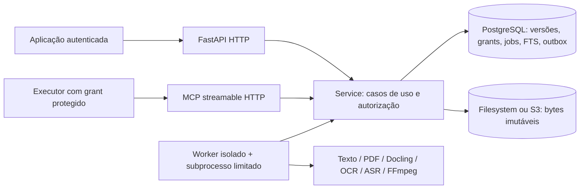

# Arquitetura

`domain` contém tipos portáveis, sem frameworks. `application.Service` concentra autorização,
idempotência e transações. O mapeamento ORM é compartilhado de forma pragmática com essa
camada; transportes não executam SQL de domínio. `infrastructure` implementa storage,
extração, captura e manutenção. `presentation` valida contratos, resolve autenticação e
encaminha HTTP/MCP ao mesmo serviço. `bootstrap` seleciona adapters.

O banco impõe namespace consistente entre fonte/versão/representação/asset/segmento,
collections, e pointers atuais. A representação publicada é imutável por trigger. Cada
namespace mantém geração própria de índice para não revelar atividade de outro tenant.
Blocks ficam em JSONB canônico; segmentos/asset refs são materializados para busca e entrega.

Jobs são adquiridos com `FOR UPDATE SKIP LOCKED`; token e geração de lease são revalidados
na publicação. Extraction roda fora da API, com deadline, memória/CPU limitadas e processo
de grupo próprio. Um timeout encerra também os subprocessos de OCR/FFmpeg.

Não existe dependência de Woobe/WOS para inicialização, fila, consulta ou recuperação.
O enrichment HTTP é uma porta opcional, com bytes explícitos e idempotência; nunca uma
cadeia recursiva de Tools WKS. Nenhum serviço pedagógico ou conta de aluno pertence ao WKS.
