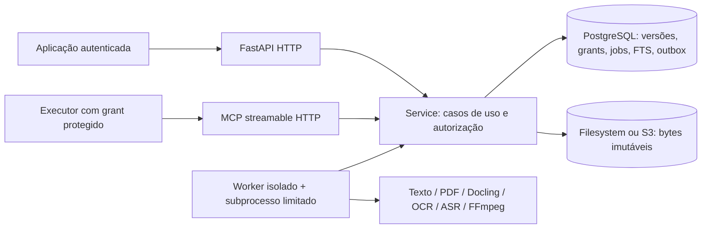

# Arquitetura

O workspace contém seis pacotes, seguindo a organização do WOS:

- `packages/wks-core/src/wks_core`: `domain`, `application`, `ports`, `storage`, settings e roteamento de filas.
- `packages/wks-api/src/wks_api`: `http`, `mcp`, `contracts`, `authentication`, `server`, `web/assets`.
- `packages/wks-worker`: runtime de execução, leases, subprocessos e publicação.
- `packages/wks-worker-native`, `wks-worker-docling`, `wks-worker-media`: decoders independentes.

`domain` contém tipos portáveis, sem frameworks. `application.Service` concentra autorização,
idempotência e transações. O mapeamento ORM é compartilhado de forma pragmática com essa
camada; transportes não executam SQL de domínio. `storage` implementa persistência,
captura e manutenção. A extração pertence aos pacotes de workers. `http` e `mcp` validam contratos e invocam o Service;
`server/bootstrap` seleciona adapters. A API depende do núcleo; o sentido inverso é
verificado por teste. Migrações continuam na raiz do deployment.

O frontend `/app/` usa os mesmos contratos HTTP e autorização. `authentication` mantém
sessões opacas com hash no banco, cookies HttpOnly e verificação de CSRF/origem. MCP exige
Bearer e grant, sem aceitar cookies do navegador. Restore invalida sessões do backup.
Veja [a decisão e a referência WOS](adr/0004-wos-package-and-workspace-pattern.md).

O banco impõe namespace consistente entre fonte/versão/representação/asset/segmento,
collections, e pointers atuais. A representação publicada é imutável por trigger. Cada
namespace mantém geração própria de índice para não revelar atividade de outro tenant.
Blocks ficam em JSONB canônico; segmentos/asset refs são materializados para busca e entrega.

A fila persistente (`native`, `docling`, `media`) é definida por MIME/política. Cada worker
filtra sua fila antes do claim, inclusive na recuperação de leases expirados.
Jobs são adquiridos com `FOR UPDATE SKIP LOCKED`; token e geração de lease são revalidados
na publicação. Extraction roda fora da API, com deadline, memória/CPU limitadas e processo
de grupo próprio. Um timeout encerra também os subprocessos de OCR/FFmpeg.

Não existe dependência de Woobe/WOS para inicialização, fila, consulta ou recuperação.
O enrichment HTTP é uma porta opcional, com bytes explícitos e idempotência; nunca uma
cadeia recursiva de Tools WKS. Nenhum serviço pedagógico ou conta de aluno pertence ao WKS.
