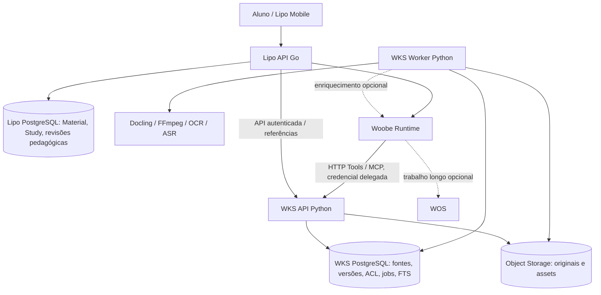
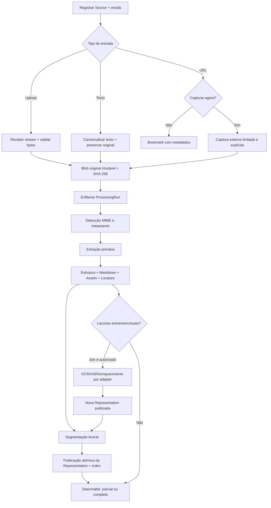

# WKS — Woobe Knowledge Service

## Plano completo de implementação — proposta arquitetural e operacional

**Versão do documento:** 1.0 — 08/10/2026  
**Projeto:** WKS (novo serviço independente, implementado em Python)  
**Primeiro produto consumidor:** Lipo  
**Integrações:** Woobe Runtime por HTTP/MCP/Knowledge Strategy; WOS apenas opcionalmente para coordenação de trabalho dos Agents  
**Natureza:** planejamento técnico e de produto. Nenhuma implementação é considerada concluída por este documento.

> **Decisão irrevogável para este recorte:** o WKS **NÃO** terá embeddings, vetores, `pgvector`, vector stores, similaridade vetorial, busca semântica por vetores ou índices híbridos com vetores. A recuperação será **exclusivamente textual**, baseada no conteúdo extraído, descrições textuais disponíveis e metadados. Eventual mudança de direção exige decisão futura explícita; não se deve antecipar abstrações, migrações ou dependências vetoriais.

---

## Sumário

- [0. Decisões executivas](#0-decisões-executivas)
- [1. Estado atual auditado e impacto no novo serviço](#1-estado-atual-auditado-e-impacto-no-novo-serviço)
- [2. Escopo de produto e matriz de modalidades](#2-escopo-de-produto-e-matriz-de-modalidades)
- [3. Limites dos serviços e topologia](#3-limites-dos-serviços-e-topologia)
- [4. Modelo de domínio do WKS](#4-modelo-de-domínio-do-wks)
- [5. Processamento: pipeline técnico, formatos e estados](#5-processamento-pipeline-técnico-formatos-e-estados)
- [6. Pesquisa exclusivamente textual](#6-pesquisa-exclusivamente-textual)
- [7. Segurança, tenancy e delegação de acesso](#7-segurança-tenancy-e-delegação-de-acesso)
- [8. Contratos públicos HTTP e MCP](#8-contratos-públicos-http-e-mcp)
- [9. Integração concreta com Lipo](#9-integração-concreta-com-lipo)
- [10. Integração concreta com Woobe e WOS](#10-integração-concreta-com-woobe-e-wos)
- [11. Persistência e estrutura física em Python](#11-persistência-e-estrutura-física-em-python)
- [12. Operação, monitoramento e configuração](#12-operação-monitoramento-e-configuração)
- [13. Sequência de implementação — milestones com gates](#13-sequência-de-implementação-milestones-com-gates)
- [14. Matriz de aceitação reproduzível](#14-matriz-de-aceitação-reproduzível)
- [15. Backlog orientado a entregas / PRs](#15-backlog-orientado-a-entregas-prs)
- [16. Decisões ainda configuráveis, sem bloquear a arquitetura](#16-decisões-ainda-configuráveis-sem-bloquear-a-arquitetura)
- [17. Definition of Done para lançamento com a Lipo](#17-definition-of-done-para-lançamento-com-a-lipo)
- [18. Referências técnicas verificáveis](#18-referências-técnicas-verificáveis)
- [19. Resolução arquitetural final](#19-resolução-arquitetural-final)

---

## 0. Decisões executivas

| ID | Decisão | Consequência prática |
|---|---|---|
| D01 | WKS é **servidor independente de fontes e recuperação de conhecimento** | API, workers, storage e índices pertencem ao WKS; seu domínio não depende da Lipo, Woobe ou WOS. |
| D02 | WKS **armazena o original** e derivados técnicos | Os arquivos de novos materiais, após migração, passam a ter o WKS como autoridade de armazenamento. A Lipo guarda vínculo e referência, não cópia autoritativa. |
| D03 | **Qualquer formato pode ser armazenado; nem todo formato será processável** | Entrada de tipo desconhecido vira fonte `metadata_only`/`unsupported_processing`, sem prometer interpretação. Limites de upload permanecem configuráveis. |
| D04 | Markdown é uma **view**, não a verdade estrutural | O WKS conserva a representação estruturada, segmentos, assets e proveniência, além de Markdown para leitura. |
| D05 | Texto, imagem, áudio, vídeo e links têm identidade preservada | Um Agent pode localizar um trecho textual e solicitar a mídia original/derivada à qual se refere. |
| D06 | **Busca textual PostgreSQL Full-Text Search** | `tsvector`, `tsquery`, GIN, ranking lexical, filtros e paginação. Nada de modelos de embedding. |
| D07 | **Escopos autorizados são impostos pelo servidor** | Nenhum `user_id`, `namespace_id`, `study_id` ou token de acesso escolhido pelo modelo amplia permissões. |
| D08 | Processamento pode ter **cobertura parcial** | Texto utilizável fica pesquisável enquanto OCR/transcrição/análise visual pendentes continuam identificados. |
| D09 | WKS opera **sem Woobe e sem WOS** | Extração, indexação, busca e leitura independentes. Enriquecimento por IA é adapter opcional. |
| D10 | HTTP e MCP são **transportes sobre os mesmos casos de uso** | Sem duas implementações divergentes de autorização ou busca. |
| D11 | Lipo mantém autoridade pedagógica | `Study`, `Roadmap`, `Wave`, `Content`, `Assessment`, `Progress`, agenda e retenção não entram no WKS. |
| D12 | Integração inicial **não exige Knowledge Strategy dedicada** | HTTP/MCP para busca/leitura. Adapter `WKSKnowledgeStrategy` fica em fase posterior, sem substituir RAG atual. |
| D13 | **Não duplicar o processamento na Lipo** | Adotar migração gradual dos adapters existentes; apenas um dono técnico por novo original. |
| D14 | Nenhum grafo semântico inferido automaticamente no lançamento | Registrar apenas relações documentais verificáveis (bloco → imagem; trecho → áudio; frame → vídeo; fonte → URL). |
| D15 | Lançamento condicionado a evidência ponta a ponta | Enviar PDF com imagem, localizar texto, recuperar a imagem por autorização, disponibilizá-la efetivamente ao Agent compatível e produzir material com proveniência. |

### 0.1 Definição curta do produto

**Woobe Knowledge Service (WKS)** recebe, armazena, processa, versiona e indexa fontes multimodais em escopos autorizados. Produz representações textuais pesquisáveis sem perder acesso aos originais ou assets e disponibiliza pesquisa, navegação e leitura por HTTP/MCP.

**Não é:** memória universal de agentes; estado de execução do WOS; pipeline pedagógico da Lipo; orquestrador de agentes; motor de inferência; plataforma vetorial; knowledge graph automático.

### 0.2 Critério norteador

> Uma fonte complexa deve tornar **seu conteúdo textual recuperável** tão cedo quanto possível e manter **seus componentes multimodais localizáveis e recuperáveis**, sem que um resumo substitua silenciosamente o original.

---

## 1. Estado atual auditado e impacto no novo serviço

Leituras sobre os repositórios conectados em 08/10/2026; os detalhes representam a situação observada nos arquivos da branch `master` consultados, **não** certificam que um deployment ou PR pendente já esteja em produção.

### 1.1 Lipo: capacidades reaproveitáveis

O repositório já declara/implementa, em seu pipeline de materiais:

- `Material`, `MaterialRevision` e vinculação a `Study`, associados ao usuário/`LearnerID`.
- `BlobStorage` com filesystem e S3-compatible; uploads por streaming, checksums SHA-256, revisão e operações idempotentes.
- `analysis_request`, workers, lease/fencing, retry e `source_snapshots` com `locator_kind`, `locator_value`, conteúdo e checksum.
- Extração de texto/PDF textual e adapter HTTP para OCR/vision; não há prova de configuração de provider externo real em todos os ambientes.
- Planejamento/geração/Tutor alimentados por snapshots congelados; manutenção autoritativa de decisões e evidências pedagógicas.
- `lipo-mcp` de leitura autenticada, atualmente via `stdio` e credencial vinculada ao processo; host remoto multiusuário ainda não é uma capacidade pronta.

**Mudanças necessárias na Lipo**: deixar de possuir o pipeline técnico completo para novos materiais, adotar referências versionadas do WKS, manter material/ownership/study e aceitar citações verificadas dinamicamente sem abandonar invariantes históricas.

**NÃO fazer**: eliminar o modelo `Material`; acoplar Go diretamente às tabelas PostgreSQL do WKS; usar WKS como `Study` ou como administrador de Roadmaps; declarar que todos os materiais históricos foram migrados antes de reconciliação.

Fontes:
- [Lipo — README](https://github.com/A1b3rt0M3rcad0/lipo/blob/master/README.md)
- [Lipo — material e ingestão](https://github.com/A1b3rt0M3rcad0/lipo/blob/master/packages/lipo-api/README.md)
- [Lipo — Analyzer port](https://github.com/A1b3rt0M3rcad0/lipo/blob/master/packages/lipo-core/modules/material/ports/analysis.go)
- [Lipo — workflow de análise](https://github.com/A1b3rt0M3rcad0/lipo/blob/master/packages/lipo-core/modules/material/workflows/analysis.go)
- [Lipo — integração MCP](https://github.com/A1b3rt0M3rcad0/lipo/blob/master/packages/lipo-mcp/README.md)
- [Lipo — roadmap operacional](https://github.com/A1b3rt0M3rcad0/lipo/blob/master/docs/ROADMAP.md)

### 1.2 Woobe: bases e limitações

- Agents/Networks, Tools HTTP/MCP, Runs, Sessions e releases imutáveis já fazem parte de sua arquitetura.
- Existe protocolo genérico `KnowledgeStrategy` / `KnowledgeCapabilities` / `KnowledgeSource`.
- O MCP remoto atualmente documentado usa `streamable_http` e política de permissões por Tool (`review`, `allow`, `deny`); OAuth por usuário final **não** é uma capacidade pronta no contrato documentado.
- O `External Context` já permite passagem de escopos pelo runtime. **Isso não autoriza supor** que uma Tool receba automaticamente uma credencial delegada e segura por Run/usuário.
- O pipeline atual de resultado de Tool contém compactação para texto. Um `resource_link` no retorno não comprova que o modelo recebeu bytes de imagem/áudio/vídeo na sua modalidade original.
- O adapter Go existente na Lipo serializa payload para string em `Chat`, portanto não significa transporte multimodal nativo.

**Mudanças na Woobe**: primeira integração segura de leitura WKS por Tool; materialização multimodal efetiva, quando suportada pela estratégia/modelo; projeção autorizada de contexto em chamadas de Tools; evidência de origem da fonte, do tipo de mídia e de limitações.

Fontes:
- [Woobe — arquitetura](https://github.com/A1b3rt0M3rcad0/woobe/blob/master/docs/ARCHITECTURE.md)
- [Woobe — MCP Tools](https://github.com/A1b3rt0M3rcad0/woobe/blob/master/docs/runtime/MCP_TOOLS.md)
- [Woobe — KnowledgeStrategy](https://github.com/A1b3rt0M3rcad0/woobe/blob/master/packages/woobe-core/src/modules/agent/application/interfaces/knowledge.py)
- [Woobe — compactação de Tool output](https://github.com/A1b3rt0M3rcad0/woobe/blob/master/packages/woobe-core/src/modules/agent/application/use_cases/tool_output_compaction.py)
- [Lipo — Woobe runtime adapter](https://github.com/A1b3rt0M3rcad0/lipo/blob/master/packages/lipo-api/platform/woobe/runtime.go)
- [Woobe SDK Go](https://github.com/A1b3rt0M3rcad0/woobe-sdk-go/blob/master/README.md)

### 1.3 WOS: somente coordenação de trabalhos dos Agents

O WOS modela Outcomes, objetivos, work items e coordenação de trabalho persistente; **não** deve ser o mecanismo obrigatório de fila, status, recovery, estado ou processamento técnico do WKS. WKS possui seus próprios jobs de ingestão/indexação. Uma execução da Woobe **pode** recorrer ao WOS para coordenar revisão humana, análise aprofundada ou curadoria de um conjunto de fontes, com referências WKS como artefatos/evidências.

Fonte: [WOS — README](https://github.com/A1b3rt0M3rcad0/wos/blob/master/README.md).

---

## 2. Escopo de produto e matriz de modalidades

### 2.1 Entregável v0.1 (prioritário para a Lipo)

**P0 obrigatório:** catálogo de fontes escopado; upload e retenção de originais; revisões; processamento assíncrono; extração de formatos relevantes; representações estruturadas + Markdown; relações a assets; indexação/pesquisa textual; leitura e download autorizados; status detalhado; API HTTP; MCP de leitura; integração Lipo; testes de isolamento e recuperação.

**P1 do primeiro ciclo, ativável por feature flag:** transcrição de áudio; vídeo com transcrição e frames; URL com captura explícita de conteúdo público; interpretação de elementos visuais por adapter externo; passagem multimodal efetiva WKS → Woobe com homologação de provider compatível.

A ordem exata de habilitação de P1 deve respeitar recursos disponíveis no deployment. O formato pode ser armazenado antes de seu processador estar habilitado.

### 2.2 Modalidades e política por formato

| Fonte | Original | Extrator inicial | Representação pesquisável | Assets/locators | Estado se não interpretável |
|---|---|---|---|---|---|
| TXT/MD/CSV/JSON/YAML | Bytes originais | Decodificação validada; normalização | Texto/Markdown e seções | `section`/`chunk`/linhas | Metadata-only se encoding/formato inválido |
| PDF textual | PDF | Parser de texto/layout | Seções, tabelas, parágrafos | `page`, região/figuras | Parcial em páginas problemáticas |
| PDF escaneado | PDF | OCR seletivo | Texto com referência de página | Página/imagem/`bbox` | `needs_processing` se OCR indisponível |
| DOCX/PPTX/HTML | Arquivo/captura | Docling/HTML parser | Markdown + estrutura | Seções/slides/imagens | Parcial se elemento ilegível |
| Imagem JPG/PNG/WebP etc. | Imagem | OCR quando aplicável | OCR, metadados, descrições opcionais | Referência à imagem integral | Pesquisável por metadados mesmo sem OCR |
| Áudio | Arquivo de áudio | ASR/transcrição | Transcrição com intervalo temporal | `time_range`, referência ao original | Original acessível, texto pendente |
| Vídeo | Arquivo de vídeo | Faixa de áudio + frames selecionados | Transcrição; descrições de frames opcionais | `time_range`, `frame`, thumbnail/asset | Não declarar compreensão visual integral |
| URL/bookmark | URI + metadados | **Nenhuma captura automática** | Título/descrição/metadados fornecidos | URI original | `bookmark_only` |
| URL importada explicitamente | URI + captura com data | Captura HTTP pública autorizada + processador correspondente | Texto/captura | URI + snapshot da resposta | Falha de captura preserva bookmark |
| Formato desconhecido | Bytes originais | Nenhum | Nome, tipo e metadados | Referência ao blob | `unsupported_processing` |

**Precisão dos claims:** OCR não significa interpretação visual; transcrição não significa compreensão de áudio além da fala; amostragem de frames não significa análise completa do movimento. Diferenciar cobertura da indexação, cobertura da modalidade e qualidade da interpretação.

### 2.3 Capacidade de pesquisa

- Pesquisar **palavras, expressões, frases e metadados** em todas as fontes visíveis no escopo autorizado.
- Filtrar por coleção, fonte, mídia, período, processador, disponibilidade e revisão.
- Navegar por outline/seção, ler intervalos ordenados e percorrer conteúdos longos com cursor.
- Retornar hits com snippets, score lexical, `source_id`, `source_version_id`, `representation_id`, `segment_id`, locator e refs de assets relacionados.
- O índice pesquisa **texto derivado da mídia**, não semelhança visual/acústica direta.
- Não inferir equivalência semântica entre termos sem correspondência lexical; um Agent pode expandir consultas textuais, mas isso não muda o mecanismo de busca.

### 2.4 Explicitamente fora do v0.1

1. Embeddings, `pgvector`, bancos vetoriais e índices semânticos/híbridos com vetores.
2. Grafo automático de conceitos entre documentos; relações inferidas; reconhecimento automático de contradições entre fontes.
3. Crawler irrestrito, scraping de serviços autenticados, bypass de paywall/DRM ou extração obrigatória de qualquer URL.
4. Entender todos os frames de vídeo ou produzir descrição universal de conteúdos audiovisuais.
5. Edição colaborativa de Markdown como fonte autoritativa.
6. App próprio completo de knowledge management; a Lipo entrega a UI ao aluno.
7. Agenda pedagógica, aprendizado espaçado, geração de currículo, correção de tarefas ou progresso educacional.
8. Dependência de WOS, Agentyc, Woobe Cloud ou `Runtime Jobs` da Woobe.
9. Motor de OCR/ASR/conversão próprio do zero.
10. Multi-provider automático, roteamento por custo de IA ou autoaperfeiçoamento/autocuradoria sem autorização explícita.

---

## 3. Limites dos serviços e topologia



### 3.1 Unidades implantáveis

- **`wks-api`**: FastAPI, endpoints administrativos de fontes e runtime de busca/leitura, endpoint remoto MCP, health/readiness, autenticação e autorização.
- **`wks-worker`**: mesmo pacote Python de domínio/casos de uso, processo separado para tarefas I/O e CPU-intensivas; concorrência e limites configuráveis.
- **`postgres`**: fonte durável de metadados, autorização materializada, jobs e índice textual.
- **`object-storage`**: originais, imagens/frames extraídos, representações JSON/MD quando grandes, thumbnails e capturas.
- **`docling`**: usado diretamente pelo worker, sob adapter e versões fixadas; Docling Serve só se houver necessidade operacional comprovada de um processo de conversão compartilhado.
- **WOS e Woobe**: não entram nas dependências de inicialização do WKS. Sua indisponibilidade não impede consulta ao conteúdo já publicado.

**Decisão de simplicidade:** não adicionar RabbitMQ, Celery, MongoDB, Elasticsearch, Kafka, Redis ou outra fila no primeiro ciclo. Usar PostgreSQL para claim de jobs (`FOR UPDATE SKIP LOCKED`), leases, fencing e outbox. Trocar essa infraestrutura somente quando métricas exigirem.

### 3.2 Dependências sugeridas

| Camada | Recomendação | Justificativa |
|---|---|---|
| Runtime | Python 3.12+; `uv` para lock/install | Alinhar stack Python com Woobe/Lipo MCP sem prender domínio a uma versão específica. |
| HTTP | FastAPI + Pydantic v2 | Schemas, OpenAPI e validação de borda. |
| Banco | SQLAlchemy 2.x + Alembic + driver PostgreSQL | Unit of Work, persistência versionada e migrations controladas. |
| Storage | `boto3` / S3-compatible; filesystem para dev/testes | Abstração `ObjectStore`, sem SQL contendo binários. |
| Documentos | Docling | PDF, office, OCR/layout e representação intermediária. |
| Vídeo/áudio | FFmpeg; capacidades Docling/ASR configuradas | Normalização e transcrição/frames sem motor próprio. |
| Páginas HTML | Trafilatura como extrator de conteúdo | Captura separada de importação; HTML preservado como original capturado. |
| MCP | SDK oficial Python MCP, remoto `streamable_http` | Interoperabilidade com Woobe após qualificação da versão de protocolo. |
| Pesquisa | PostgreSQL Full-Text Search + GIN | Busca lexical sem vetores. |
| Qualidade | Ruff, mypy opcional, pytest, pytest-asyncio, testes PostgreSQL reais | QA e contratos verificáveis. |
| Observabilidade | OpenTelemetry, logs estruturados, Prometheus quando disponível | Correlação e métricas por etapa sem payload sensível. |

**Licenças, pesos de OCR/ASR e requisitos de hardware** devem ser revisados no lock do release; licença da biblioteca não cobre automaticamente qualquer peso de modelo baixado. Não usar versões flutuantes no deployment.

Fontes externas:
- [Docling formatos e outputs](https://docling-project.github.io/docling/usage/supported_formats/)
- [Docling áudio/vídeo](https://docling-project.github.io/docling/usage/processing_audio_media/)
- [Docling Serve API](https://docling-project.github.io/docling/usage/api_server/rest_api/)
- [Trafilatura](https://trafilatura.readthedocs.io/en/latest/usage-python.html)
- [PostgreSQL Full-Text Search](https://www.postgresql.org/docs/17/textsearch-controls.html)
- [MCP Tool Results](https://modelcontextprotocol.io/specification/2026-07-28/server/tools)

---

## 4. Modelo de domínio do WKS

### 4.1 Vocabulário canônico

| Entidade | Papel | Autoridade |
|---|---|---|
| **Client/Application** | Sistema integrador autenticado (`lipo`, outros produtos) | WKS cadastra identidade do cliente, não contas dos usuários dos produtos. |
| **Namespace** | Fronteira persistente de organização/isolamento autorizada | WKS valida grants; cliente mapeia seus escopos de negócio. |
| **Collection** | Agrupamento lógico opcional de fontes dentro do namespace | Não é Study; pode representar qualquer seleção autorizada. |
| **Source** | Fonte lógica cadastrada (arquivo, texto, bookmark, captura, referência) | Identidade estável sem presumir formato processável. |
| **SourceVersion** | Revisão imutável do original ou captura | Alteração do conteúdo original gera versão nova. |
| **BlobObject** | Objeto físico imutável, hash, size, MIME, provider e storage key | Não carregar segredos em IDs retornados. |
| **ProcessingRun** | Uma tentativa/processamento versionado de uma SourceVersion | Distinto de Woobe Run e de WOS WorkItem. |
| **Representation** | Publicação versionada de conteúdo extraído (estrutura + Markdown) | Reprocessar sem alterar original gera nova Representation. |
| **Block/Node** | Unidade de estrutura: heading, paragraph, table, picture, equation, transcript, frame etc. | Ordem, `parent`, posição no original, idioma e origem. |
| **Asset** | Mídia derivada ou apontamento ao original | Imagem, frame, áudio, vídeo, recorte, thumbnail, anexo. |
| **Segment** | Unidade textual indexável | Referência a 1+ Blocks e opcionalmente Assets, sem duplicar autoridade da estrutura. |
| **Locator** | Localização verificável no original | Página, seção, slide, região, trecho temporal, frame ou byte range. |
| **ScopeGrant** | Permissão materializada ou delegação de acesso | Avaliada em cada busca, leitura e download. |
| **Operation/Event** | Idempotência, progresso, auditabilidade e reconciliação | Controlado pelo WKS. |

**Evitar o termo `Document` como raiz universal:** áudio, vídeo e URL não são necessariamente documentos. O termo de domínio primário é **Source**. `Document` pode aparecer como categoria de apresentação.

### 4.2 Relações permitidas

```text
Client ── Namespace ── Collection ── Source
                       └───────────> Source [N:M]
Source ── SourceVersion ── BlobObject
             └── ProcessingRun ── Representation
                                   ├── Block [tree]
                                   ├── Asset [0..N]
                                   └── Segment [0..N] → Block [1..N]
Block ───(explicit origin reference)───> Asset/SourceVersion/Locator
```

- Fonte pode integrar múltiplas Collections do **mesmo escopo autorizado**, sem duplicar bytes.
- A mesma SourceVersion pode ter várias Representations de processadores/versões diferentes.
- Segmentos apontam para a estrutura; a estrutura aponta para os assets e origem.
- Links explícitos que constam do documento são dados extraídos, **não** arestas inferidas de um grafo semântico.
- Não existirão `Study`, `Lesson`, `Learner`, `Wave`, `Mastery`, `Outcome`, `WorkItem` como entidades mandatórias do WKS.

### 4.3 Identidade, proveniência e imutabilidade

**Identidades:** UUID/ULID gerados pelo servidor; identificadores opacos, sem permissão implícita. Sempre guardar `namespace_id` explicitamente nos recursos de leitura, índices e ACL.

**Conteúdo:** checksum SHA-256 de bytes do original e derivados; `processor_name`, `processor_version`, `config_digest`, `artifact_digest`, `created_at`; nunca reescrever publicação imutável em nome da otimização.

**Versionamentos distintos:**

1. `source_version`: novo original, nova captura explicitamente solicitada ou modificação do texto fornecido.
2. `processing_run`: execução/tentativa sobre uma versão da fonte com uma configuração fixada.
3. `representation_id`/`representation_revision`: representação publicada, cuja árvore e assets não mudam após publicação.
4. `index_generation`: confirmação de que segmentos desta representação foram publicados no índice; atualização de índice não altera o original.

**Ativação:** uma Source pode apontar para `current_source_version_id` e cada SourceVersion para `current_representation_id`; consultas históricas resolvem IDs explícitos e não fazem fallback silencioso para `latest`.

### 4.4 URI de referência estável

Proposta de URIs internas (não são URLs de download nem credenciais):

```text
wks://sources/{source_id}/versions/{source_version_id}
wks://representations/{representation_id}/blocks/{block_id}
wks://representations/{representation_id}/segments/{segment_id}
wks://assets/{asset_id}
```

Cada identificador recuperado exige consulta autorizada. Markdown pode usar `wks://assets/...` como alvo de imagem/link, acompanhado de `alt`, `caption` e da proveniência estruturada. Não serializar bearer tokens, links assinados temporários ou caminho absoluto de bucket no Markdown. O renderer precisa resolver a URI no servidor.

Exemplo ilustrativo:

```markdown
## Resistores em paralelo

A tensão aplicada aos ramos é igual.


```

O Asset referenciado guarda `source_version_id`, `representation_id`, `page=12`, `bbox` se mensurável, MIME, checksum e objeto armazenado. Isso permite um Agent compatível solicitar **a imagem**, não somente a descrição textual.

### 4.5 Modelo mínimo de metadados

Campos de Source: `id`, `client_id`, `namespace_id`, `kind`, `title`, `description`, `media_type`, `tags`, `external_uri?`, `state`, `current_version_id?`, `created_at`, `updated_at`, `deleted_at?`, `created_by` (identidade técnica/auditável).

Campos de SourceVersion: `id`, `source_id`, `revision_number`, `original_blob_ref?`, `external_uri?`, `captured_at?`, `checksum?`, `byte_size?`, `original_filename?`, `media_type_detected`, `created_at`.

Campos de Representation: `id`, `source_version_id`, `processor_identity`, `status`, `coverage`, `structure_ref`, `markdown_ref`, `index_generation?`, `published_at?`.

Campos de Asset: `id`, `representation_id`, `kind`, `media_type`, `blob_ref`, `locator`, `caption?`, `derived_from_block_id?`, `checksum`.

Campos de Segment: `id`, `representation_id`, `ordinal`, `block_refs`, `text`, `origin_kind`, `language`, `locator`, `asset_refs`, `checksum`, `search_vector` (tipo **PostgreSQL `tsvector`: léxico**, não embedding).

### 4.6 Política de deleção e retenção

- Remoção lógica/revogação torna busca, leitura e download indisponíveis **imediatamente na transação de autorização**; limpeza física/índice pode ser assíncrona.
- `delete` precisa ser idempotente; auditoria registra metadados da ação, nunca os bytes apagados.
- `purge` e exclusão de usuário exigem apagar versões/derivados, caches e índices conforme política, inclusive links temporários emitidos quando ainda forem válidos (usar TTL baixo e possibilidade de revogação no gateway).
- Referências pedagógicas históricas podem permanecer como identificadores/tombstones, mas nunca expor o conteúdo de um material revogado/apagado.
- Retenção e backup devem ter política explícita de expurgo; backup não equivale a acesso ativo e requer prazo de retenção definido pela operação.

## 5. Processamento: pipeline técnico, formatos e estados

### 5.1 Fluxo de ingestão universal



**Invariantes:**

- Registrar e concluir upload é idempotente; bytes sem checksum confirmado não viram versão ativa.
- Uma falha em um processador não apaga o original nem uma representação anterior válida.
- Processamentos não sobrescrevem o conteúdo de outras versões.
- O processamento opera a partir de bytes/conteúdo materializado e validado; não repete captura arbitrária de URL durante retries.
- Todo texto indexado tem provenance `source_version_id + representation_id + locator + origin_kind`.
- O resultado `ready_text` não significa `ready_all_modalities`.

### 5.2 Estados independentes

**Estado da fonte** (`source_state`):

- `registered` — Source criada, upload/captura pendente.
- `stored` — original ou bookmark registrado e acessível.
- `revoked` — acesso à fonte revogado; nenhuma leitura autorizada.
- `deleted` — limpeza/expurgo concluído para os componentes em escopo.

**Estado técnico da operação** (`processing_state`):

- `queued`, `running`, `retry_wait`, `succeeded`, `partial`, `failed`, `cancelled`.

**Disponibilidade de consulta** (`availability`):

- `metadata_only`: título/metadados buscáveis; sem texto extraído.
- `text_partial`: parte do conteúdo indexada, pendências conhecidas.
- `text_ready`: conteúdo textual processável publicado para o perfil configurado.
- `unsupported_processing`: original válido, formato sem processador habilitado.

`availability` **não** é um substituto para os estados dos jobs. Uma fonte com `text_partial` pode ter operação `running`. Uma fonte com `text_ready` pode receber uma nova versão de processamento sem perder a versão anterior.

**Cobertura por modalidade** (`coverage`):

```json
{
  "text": {"state": "complete", "processed_pages": 24, "total_pages": 24},
  "ocr": {"state": "partial", "processed_regions": 6, "pending_regions": 2},
  "audio": {"state": "not_applicable"},
  "visual": {"state": "pending", "assets_identified": 8, "assets_enriched": 0}
}
```

Exemplo ilustrativo. Somente publicar contagens que o processor mediu; `unknown` é aceitável. Não inventar porcentagem de “conteúdo compreendido”.

### 5.3 Contrato interno de processamento

Adotar interface principal:

```python
class SourceProcessor(Protocol):
    async def inspect(self, source: SourceInput) -> InspectionResult: ...
    async def extract(self, source: SourceInput, policy: ProcessingPolicy) -> ExtractedRepresentation: ...
```

`ExtractedRepresentation` deve conter:

- `document_tree`: árvore/estrutura canônica do WKS, não objeto Docling vazando para Domain.
- `text_blocks`: tipo, texto, ordem, idioma, origem, locator, headings/parent.
- `assets`: referências opacas aos binários e locator.
- `relations`: **somente** relações com evidência de origem (`embedded_in`, `derived_from`, `occurs_at`).
- `extraction_facts`: capacidades executadas, parâmetros, cobertura, limites e avisos.
- `producer_identity`: biblioteca/versão/configuração e hashes.

**Adaptadores:** `TextProcessor`, `DoclingProcessor`, `AudioProcessor`, `VideoProcessor`, `ImageProcessor`, `WebContentProcessor`, `UnsupportedProcessor`. Seleção por conteúdo detectado e policy; extensão por registry, não por `if` espalhados.

### 5.4 JSON estruturado é o canônico; Markdown é exportação

Persistir árvore estruturada portável (`representation.json`) como verdade técnica. O Markdown deve ser **gerado deterministicamente** dessa árvore + refs estáveis. A segmentação textual também deriva da mesma árvore. Não usar parsing reverso do Markdown para descobrir onde estavam a página, a região ou a imagem.

**Tipos de bloco mínimos:** `heading`, `paragraph`, `list`, `table`, `code`, `equation`, `picture_ref`, `audio_transcript`, `video_frame_ref`, `link_ref`, `unknown`.

**Preservar:** ordem documentada, aninhamento, número de página/slide, timestamps, media MIME, caption original e origem do texto (`native_text`, `ocr`, `transcript`, `ai_description`). Não atribuir metadados inexistentes em nome de “normalizar”.

### 5.5 PDF complexo com imagens e tabelas

1. Processar com Docling em perfil seguro, mantendo layout e ordem.
2. Priorizar texto nativo; executar OCR por página/região quando extração textual falhar ou houver evidência de imagem com texto relevante.
3. Extrair imagens/figuras quando possível como `Asset` com locator original.
4. Exportar Markdown com `wks://assets/{asset_id}`, alt/caption quando disponíveis.
5. Representar tabela também em estrutura; Markdown é projeção legível, não fidelidade universal para tabelas complexas.
6. Fórmulas podem conservar expressão extraída e imagem original quando a representação textual não for confiável.
7. Marcar páginas/regiões sem leitura como pendentes, sem afirmar completude.
8. Preservar figuras originais que possam servir como referência para materiais produzidos na Lipo.

**Aceite do PDF:** a figura vinculada à página deve ser recuperável como bytes MIME corretos, e seu ID deve ser estável na Representation publicada.

### 5.6 Áudio

- Preservar original; normalizar temporariamente cópia de processamento com FFmpeg quando necessário.
- Transcrever por ASR suportado e configurado. Não exigir LLM geral se houver transcritor apropriado.
- Produzir blocos com `start_ms`, `end_ms`, texto, idioma/detector, informações de speaker **somente** quando realmente disponíveis.
- Não inventar fala de trechos silenciosos/inaudíveis. Se qualidade ruim, marcar `uncertain`/`untranscribed` com localização.
- Indexar fala transcrita e permitir `read_asset` do original/trecho; no v0.1 uma referência ao intervalo original é suficiente, sem exigir recorte de mídia persistido.
- Monitorar duração analisada e pendente; revisões de ASR geram Representation nova.

### 5.7 Vídeo

- Preservar arquivo original e checksum.
- Extrair faixa de áudio/transcrição com timestamps quando disponível.
- Selecionar frames por política limitada (ex.: por mudança de cena, com teto configurável), mantendo `time_ms` e `frame_index`.
- Indexar transcrição; indexar **descrições** de frames apenas quando produzidas e identificadas como `ai_description`.
- Representações podem conter referências a frames mesmo sem descrição textual.
- `read_asset` fornece frame/imagem e pode permitir acesso autorizado ao vídeo original. Stream/range de vídeo depende do cliente e não é obrigatório para o primeiro teste de IA.
- Não declarar representação total do vídeo com amostragem. Material não visto entre frames permanece desconhecido.

### 5.8 URLs

**Operações separadas:**

- `bookmark`: apenas armazenar URI, título/descrição declarados, data e metadados; nenhuma requisição externa obrigatória.
- `capture`: criação explícita de snapshot com conteúdo baixado, checksum e data, quando permitido.
- `recapture`: outra SourceVersion, nunca atualização silenciosa do snapshot anterior.

Para `capture`: somente HTTP/HTTPS público, sem credenciais, sem autenticação terceirizada, com redirects limitados, limites de tamanho/tipo/tempo e verificação SSRF/rebinding. Documentos PDF são roteados ao parser; HTML público pode passar por Trafilatura; conteúdos JS-only podem retornar `capture_unsupported` com bookmark preservado. Nenhuma integração especial com Google Drive, YouTube, redes sociais ou SaaS proprietários no MVP.

**URL não é `Asset` nem `SourceVersion` baixada** enquanto não houver captura. Link externo armazenado não afirma posse do conteúdo remoto. Se houver falha, preservar o registro e erro sem inventar texto extraído.

### 5.9 Enriquecimento opcional (Woobe ou outro provider)

Desenhar um port genérico:

```python
class MediaEnricher(Protocol):
    async def enrich(self, input: EnrichmentInput) -> EnrichmentResult: ...
```

Entradas: `source_version_id`, `asset_id`, locator, excerto autorizado de contexto, tarefa delimitada, contrato de saída, custo/tempo máximo configurável e `operation_id`. Saídas: `description`/`observations`, `origin_kind=ai_description`, `producer`, `model/release` se conhecidos, avisos e proveniência. O WKS **não** decide qual conteúdo deve ser ensinado ao aluno.

Política inicial:

- Mídia sem interpretação continua armazenada e pode ser lida pelo consumidor multimodal.
- Enriquecimento acontece somente se habilitado pelo cliente/política, com limites; não é pré-requisito para busca dos demais textos.
- Priorizar extração determinística/ASR/OCR antes de LLM multimodal caro.
- WKS não deve chamar Woobe obrigatoriamente; `NoopEnricher` deve manter toda funcionalidade não-IA.
- O adapter Woobe precisa provar modalidade efetivamente recebida. Se a via de runtime não suportar mídia, usar um adapter especializado de visão externo ou marcar `enrichment_unavailable`; **não** enviar URI em string afirmando ter interpretado a imagem.
- Evitar ciclos de chamadas WKS → Woobe → WKS para a mesma etapa de enriquecimento sem guarda de recursão.

### 5.10 Idempotência, retries e publicação

- `upload_commit` cria versão sob chave `(client_id, namespace_id, idempotency_key, digest_payload)`; mesma chave/payload retorna receipt original; mesma chave/payload diferente retorna conflito.
- `ProcessingRun` é identificada por `(source_version_id, policy_digest, processor_digest, intent_key)` para decidir criação vs reprocessamento solicitado.
- Claim com `SELECT ... FOR UPDATE SKIP LOCKED`; salvar `lease_token`, `owner`, `lease_generation`, `deadline` e `heartbeat`.
- Finalização só pode publicar para o lease/fencing atual e geração esperada; worker atrasado não sobrescreve outro resultado.
- Staging de `BlobObject` temporário antes de commit; promoção de metadados/Representation/index em transação; limpeza de órfãos com verificação.
- Falha transitória: backoff limitado + `retry_wait`; erro de MIME, tamanho, corrupção/unsupported não vira retry infinito.
- Resultado incerto após timeout: reconciliar por operação/receipt; **não** repetir upload ou efeito externo sem descobrir o estado anterior.
- Publicação parcial: versão nova imutável após cada conjunto validado de blocos/etapas; índice aponta apenas para Representations publicadas. Publicação posterior não modifica a anterior.
- Consumidores devem poder optar por versão fixada (reprodutibilidade) ou pela versão atual (catálogo exploratório).

---

## 6. Pesquisa exclusivamente textual

### 6.1 Motor e granularidade

Implementar no PostgreSQL, inicialmente com **Full-Text Search nativo**:

- `tsvector` gerado a partir de campos textuais permitidos (título, headings, `Segment.text`, metadados explicitamente indexáveis).
- GIN para índice principal.
- `websearch_to_tsquery` para busca natural; `phraseto_tsquery` para modo frase; validação e parâmetros bindados para não compor SQL cru.
- `ts_rank_cd`/`ts_rank` conforme avaliação do corpus, com pesos maiores para título e heading.
- Filtros de namespace/coleção/fonte/revisão/estado/tipo/idioma/intervalo temporal.
- Snippets com highlight seguro (não renderizar tags de origem como HTML ativo); ordenar por score e desempate estável (`segment_id`).
- Bounded read: resposta de search entrega previews curtos e refs; leitura integral acontece por `read` paginado.

**Sobre nomes:** o tipo SQL `tsvector` é estrutura **léxica** do PostgreSQL Full-Text Search, não embedding nem vector store. Não confundir terminologia.

### 6.2 Idiomas e normalização

- Política padrão da aplicação cliente (`pt-BR` para Lipo), com idioma detectado/sugerido por fonte/bloco e fallback `simple` quando não houver identificação confiável.
- Normalizar Unicode, espaços e caracteres de controle com preservação do texto original no JSON canônico.
- Configuração PostgreSQL apropriada (`portuguese`, `english`, `simple`) aplicada por segmento; perfis de índice por idioma devem ser definidos/testados. A versão de stemming/normalização precisa ser rastreável no index metadata.
- Caso `tsquery` fique vazio por stopwords ou termos muito curtos, fornecer fallback lexical controlado (por exemplo título e nome exato) e informar `query_not_indexable`, não varrer todo o banco inadvertidamente.
- `pg_trgm` **opcional e posterior**, somente para tolerância a erros de digitação em título/metadata; trigramas são similaridade de texto, **não vetores de embedding**. A v0.1 não depende dele.

### 6.3 Recorte SQL conceitual

```sql
-- EXEMPLO de lógica; schema e migrations finais pertencem ao WKS.
-- autorização já resolvida e aplicada no predicado do servidor.
SELECT s.id, s.representation_id, s.text,
       ts_rank_cd(s.search_vector, websearch_to_tsquery('portuguese', :q)) AS rank
FROM wks.search_segments AS s
JOIN wks.representations AS r ON r.id = s.representation_id
JOIN wks.sources AS src ON src.id = r.source_id
WHERE src.namespace_id = :authorized_namespace_id
  AND src.deleted_at IS NULL
  AND r.is_published = TRUE
  AND s.search_vector @@ websearch_to_tsquery('portuguese', :q)
  -- AND s.representation_id IN (:authorized_representation_ids)
ORDER BY rank DESC, s.id ASC
LIMIT :page_limit;
```

**Observação:** filtros no servidor devem incorporar a seleção autorizada (grants/collections/source IDs e revisões) com SQL parametrizado e plano de execução avaliado. O trecho acima demonstra apenas FTS; não é implementação pronta de ACL, paginação keyset ou idioma misto.

### 6.4 Resultado canônico de Search

```json
{
  "query": "resistência em paralelo",
  "scope": "resolved_server_side",
  "index_kind": "lexical_postgresql_fts",
  "items": [
    {
      "source_id": "src_001",
      "source_version_id": "sv_003",
      "representation_id": "rep_020",
      "segment_id": "seg_014",
      "title": "Apostila de Eletricidade",
      "snippet": "... resistências ligadas em paralelo ...",
      "rank": 0.37,
      "locator": {"kind": "page", "value": "12"},
      "origin_kind": "native_text",
      "asset_refs": ["wks://assets/asset_042"]
    }
  ],
  "next_cursor": null
}
```

Valores, scores e IDs são ilustrativos. `rank` só tem significado relativo ao algoritmo/consulta; não apresentar como probabilidade de verdade ou de relevância semântica.

### 6.5 Semântica das operações

- `search`: encontra correspondência textual no escopo efetivamente autorizado.
- `outline`: retorna árvore leve de títulos/seções/frames/timestamps para navegação.
- `read`: devolve blocos ordenados de representação específica, com cursor e limites.
- `read_asset`: retorna metadados e acesso à mídia original/derivada, após autorização; aceita ranges seguros quando aplicável.
- `list_sources`: inventário, filtros e status, sem executar a busca textual.

**Nunca retornar “todo o PDF” em um único Tool result**; limitar tamanho, exigir cursor e conservar refs para recuperação progressiva. A composição de contexto da Woobe tem limite finito; limites do WKS devem ser compatíveis com isso.

### 6.6 Indexação atômica e index generation

- Gerar segmentos a partir de uma Representation candidata imutável.
- Inserir segmentos+índices e atualizar `Representation.published_at` e `index_generation` na mesma transação do banco.
- A busca só retorna Representations publicadas/visíveis e não revogadas.
- Se índice textual precisar ser reconstruído, criar geração nova, validar contagens/hashes, então ativar a geração por escopo/revisão sem retorno parcial involuntário.
- Nunca criar `pgvector`, campos `embedding`, dimensionalidade ou migrations de vetor “para o futuro”.

---

## 7. Segurança, tenancy e delegação de acesso

### 7.1 Modelo de autoridade

1. **Cliente autenticado**: aplicativo integrador (`Lipo API`, outro cliente) pode registrar fontes em namespaces autorizados.
2. **Sujeito final**: a Lipo mantém conta e sessão do aluno; o WKS não implementa login de usuário Lipo.
3. **Grant de leitura**: autorização concedida pelo cliente confiável, limitada por namespaces/coleções/IDs de fonte/versões/operações, finalidade e prazo.
4. **Caller executor**: Woobe ou serviço de aplicação apresenta autenticação própria; WKS combina autenticação do caller com grant delegado; modelo não pode alterar o grant.

**Nunca confiar** em `user_id`, `learner_id`, `namespace_id`, `study_id`, nome de Collection ou token enviados como argumentos livres pelo Agent. O servidor resolve a identidade/grant a partir de contexto autenticado e aplica o filtro em cada operação de acesso.

### 7.2 Namespaces genéricos e mapeamento Lipo

O WKS conhece `client_id` + `namespace_id` e suas permissões. A Lipo decide se namespace corresponde a usuário, organização, biblioteca, projeto ou outro conjunto. Para o primeiro uso, propor `namespace_id` opaco por biblioteca de usuário ou tenancy: não incorporar `LearnerID` como tipo de domínio do WKS.

Uma fonte pode integrar várias Collections autorizadas. Em uma execução de Study específico, a Lipo concede somente os `source_version_id` permitidos. Um Agent em uma sessão não deve inferir que acesso à biblioteca inteira é necessário.

**Teste obrigatório:** um usuário A não consegue inferir existência (por resultados, contagem, snippets, IDs, assets ou tempos de erro discrimináveis) nem ler bytes de usuário B.

### 7.3 Contrato de delegação de leitura para Woobe

**Lacuna existente:** as credenciais de MCP da Woobe documentadas são vinculadas ao provider/projeto, não a cada usuário final. `ExternalContext` não é por si só token/capability de WKS. É necessário implementar passagem confiável de escopo **fora dos argumentos e do prompt do modelo**.

Proposta genérica e testável:

- Lipo registra `AccessGrant` no WKS por API de serviço, autorizando `source_version_ids` e ações (`search`, `read`, `asset_read`) para determinada operação/sessão, com `audience`, caller esperado (`woobe_binding_id`) e TTL curto.
- Woobe recebe uma **referência a esse grant em campo protegido de execução**, nunca inserido como instrução textual ao Agent.
- Na execução de HTTP Tool/MCP, o adapter da Woobe anexa automaticamente ao transporte a identidade técnica do provider e a referência delegada, em metadados/headers autenticados **não model-visible**.
- WKS resolve a referência, valida caller, audience, cliente emissor, expiração, status, allowed source revisions e operações. Só então realiza consulta.
- WKS pode revogar grant antes de expirar; `read_asset` e downloads temporários também obedecem a revogação/TTL.
- O modelo informa apenas `query`, `source_ref` ou `asset_ref` **dentro** do conjunto autorizado.

**Dependência real de desenvolvimento:** o runtime/connector da Woobe precisa prover tal Tool-side trusted execution context. Não considerar isso pronto apenas porque `ExternalContext` está presente. Não aceitar workaround com token mestre exposto no prompt, bearer fixo de todos os usuários ou `user_id` declarado pelo modelo.

**Caminho de migração:** antes de a Woobe suportar grants por Tool, a Lipo pode chamar o WKS diretamente em seu backend e enviar ao modelo apenas trechos aprovados, preservando snapshots. Isso permite validar ingestão e pesquisa antes da integração MCP multiusuário, **mas não conta** como homologação final da recuperação multimodal dinâmica pela Woobe.

### 7.4 Segurança de armazenamento e entrega

- Object keys derivadas pelo servidor; nunca concatenar nomes de arquivo fornecidos pelo cliente com caminhos físicos.
- Upload multipart/stream com tamanho máximo, MIME sniffing, checksum verificado; recusar path traversal, ZIP bombs, decompression bombs e excedentes de CPU/memória/tempo por política.
- URLs assinadas ou media gateway com TTL baixo, método/tipo limitados e escopo específico; preferir gateway mediado para enforcement forte de revogação imediata.
- Cabeçalhos corretos (`Content-Type`, `Content-Disposition`), sem HTML/script executável retornado como página confiável.
- Ao armazenar HTML capturado ou Markdown externo, tratar como **dados não confiáveis**, não como instruções do sistema/Agent.
- Encriptação em trânsito, segredos fora de logs e backups protegidos; política de retenção e exclusão por namespace.
- Documentos hostis podem conter prompt injection; o WKS marca a origem, mas a Woobe precisa isolar instruções de sistema de conteúdo recuperado.

### 7.5 SSRF e importação de URL

- `bookmark` não dispara fetch externo.
- `capture` tem allowlist de protocolos e validação de hostname/IP em cada hop/redirect; bloquear loopback, link-local, rede privada, metadata endpoints e destinos internos, salvo lista interna explicitamente autorizada e operada separadamente.
- Defender contra DNS rebinding durante a conexão, não apenas no parse inicial da URL.
- Limitar redirects, bytes, MIME aceitos, tempo, rate e simultaneidade; impedir porta/protocolo arbitrários.
- Não encaminhar cookies, Authorization ou credenciais da Lipo/WKS para origem externa.
- Capturas registram URI efetiva, hash, momento, resposta/erro relevante e policy aplicada.

## 8. Contratos públicos HTTP e MCP

**Princípio:** uma única camada de casos de uso (`application`) atende HTTP, MCP e workers. Transportes não importam repositórios nem pulam validação de ownership. Exemplos abaixo são **proposta de contrato v1**, não endpoints já existentes.

### 8.1 HTTP — catálogo, ingestão e consulta

Prefixo: `/v1`; paths sujeitos a autenticação de serviço, grants e políticas. IDs de namespace só são aceitos quando autorizados à identidade técnica do caller.

| Método | Rota proposta | Propósito | Identidade exigida |
|---|---|---|---|
| `POST` | `/v1/namespaces` | Criar escopo isolado autorizado ao cliente | client/admin |
| `GET` | `/v1/namespaces/{id}` | Inspecionar escopo e configurações | client/admin |
| `POST` | `/v1/sources` | Registrar Source, bookmark ou texto | client/write |
| `POST` | `/v1/sources/{id}/versions` | Iniciar nova versão do original/captura | client/write |
| `PUT` | `/v1/uploads/{upload_id}/content` | Enviar bytes por stream (ou upload multipart/adaptador) | client/write + receipt |
| `POST` | `/v1/uploads/{upload_id}/commit` | Validar checksum, confirmar SourceVersion | client/write |
| `POST` | `/v1/sources/{id}/process` | Criar/reutilizar ProcessingRun para versão+policy | client/write |
| `POST` | `/v1/sources/{id}/capture` | Capturar explicitamente URL pública | client/write |
| `GET` | `/v1/sources/{id}` | Metadados, versões, availability | client/read/grant |
| `GET` | `/v1/sources` | Catálogo paginado, filtros | client/read/grant |
| `GET` | `/v1/operations/{id}` | Estado técnico e progresso | client/read/grant |
| `GET` | `/v1/sources/{id}/outline` | Estrutura resumida de uma Representation | client/read/grant |
| `GET` | `/v1/representations/{id}/read` | Blocos/Markdown paginados e assets associados | client/read/grant |
| `POST` | `/v1/search` | Pesquisa lexical multi-fonte por escopo | client/read/grant |
| `GET` | `/v1/assets/{id}/metadata` | Tipo, checksum, locator, vínculos | client/read/grant |
| `GET` | `/v1/assets/{id}/content` | Entrega de bytes/ranges se permitidos | client/read/grant |
| `GET` | `/v1/sources/{id}/versions/{v}/original` | Original autorizado | client/read/grant |
| `POST` | `/v1/grants` | Criar delegação restrita de acesso (Lipo → Woobe) | client/admin |
| `POST` | `/v1/grants/{id}/revoke` | Revogar delegação | issuer/admin |
| `POST` | `/v1/sources/{id}/revoke` | Retirar acesso à Source | client/write |
| `DELETE` | `/v1/sources/{id}` | Solicitar exclusão/expurgo de fonte | client/admin |
| `GET` | `/health/live` | Liveness | ops |
| `GET` | `/health/ready` | Readiness PostgreSQL/storage e migrations | ops |

**Separar ingestão de upload:** `POST /sources` não precisa carregar arquivo gigantesco no JSON. `PUT` permite stream com checksum e limites. Se usar pré-assinatura de objeto, o commit precisa verificar byte length e checksum efetivamente armazenados antes da publicação.

**Leitura de assets** deve ser uma operação segura de acesso a binários; não codificar base64 de vídeo inteiro em JSON.

### 8.2 Contrato de criação (exemplo)

```json
{
  "namespace_id": "ns_opaque",
  "kind": "upload",
  "title": "Apostila de Física",
  "description": "Fonte enviada pelo aluno",
  "tags": ["eletricidade"],
  "metadata": {"declared_language": "pt-BR"},
  "upload": {
    "filename": "apostila.pdf",
    "declared_media_type": "application/pdf",
    "byte_size": 2483312,
    "checksum_sha256": "<64_hex_chars>"
  }
}
```

Cabeçalho idempotente `Idempotency-Key` obrigatório em mutações externas suscetíveis a redelivery. Resposta:

```json
{
  "source_id": "src_001",
  "source_version_id": "sv_001",
  "upload_id": "upl_001",
  "status": "registered",
  "next_action": "upload_content"
}
```

Nenhuma operação administrativa deve depender de modelo de linguagem para validar owner, versão ou checksum.

### 8.3 Contrato de busca (exemplo)

```json
{
  "query": "diferença entre tensão e corrente",
  "mode": "lexical",
  "filters": {
    "collection_ids": ["col_001"],
    "source_ids": [],
    "media_types": [],
    "representation": "current_published"
  },
  "page_size": 10,
  "cursor": null
}
```

Os campos de filtro fornecidos pelo usuário/modelo **só reduzem** o universo autorizado. O universo autorizado é aplicado antes do resultado. `mode` aceita somente `lexical` na v0.1; qualquer outro valor retorna erro de contrato, sem fallback para embeddings.

**Paginação:** cursor opaco vinculado a principal/grant, filtro, query e watermark de índice; modificar filtro invalida cursor. `GET /read` também requer versionamento fixado e offset/cursor. Limites máximos configuráveis para impedir exportação indiscriminada por paginação infinita.

### 8.4 Contrato de status (exemplo)

```json
{
  "operation_id": "op_002",
  "source_id": "src_001",
  "source_version_id": "sv_001",
  "processing_state": "running",
  "availability": "text_partial",
  "current_stage": "visual_enrichment",
  "coverage": {
    "text": {"state": "complete", "processed_pages": 24, "total_pages": 24},
    "visual": {"state": "partial", "assets_identified": 7, "assets_enriched": 3}
  },
  "published_representation_id": "rep_001",
  "attempt": 1,
  "next_retry_at": null,
  "updated_at": "2026-10-08T20:00:00Z"
}
```

A UI da Lipo pode fazer polling com `ETag`/`If-None-Match` ou versão esperada; SSE para progresso é extensão não necessária ao lançamento. Status deve representar fatos confirmados, não progresso estimado artificialmente.

### 8.5 Erros de contrato

Usar esquema consistente `code`, `message` seguro, `request_id`, `retryable`, `details` sem segredos. Classes mínimas:

- `auth.unauthenticated`, `auth.forbidden`, `auth.grant_expired`, `auth.scope_mismatch`;
- `source.not_found`, `source.revoked`, `source.version_conflict`;
- `upload.checksum_mismatch`, `upload.too_large`, `upload.content_invalid`, `upload.incomplete`;
- `processing.unsupported_format`, `processing.provider_unavailable`, `processing.timeout`, `processing.partial`;
- `search.query_invalid`, `search.cursor_invalid`, `search.index_unavailable`;
- `asset.not_found`, `asset.media_not_ready`, `asset.range_invalid`;
- `operation.idempotency_conflict`, `operation.in_progress`, `operation.reconcile_required`.

Falta de permissão para recurso individual deve usar comportamento uniforme (por exemplo `404` ou `403` conforme a superfície e política escolhidas), sem vazamento de existência.

### 8.6 MCP remoto — primeiro catálogo de Tools

**Transport:** `streamable_http`, com versão de protocolo explicitamente negociada e testada contra a Woobe instalada. A especificação MCP 2026-07-28 mudou detalhes de sessões/transporte; **não** pressupor que a implementação atual da Woobe suporte integralmente essa versão sem adaptação. Pinar combinação de versões servidor/cliente no teste de integração.

| Tool | Entrada livre do Agent | Retorno | Regras |
|---|---|---|---|
| `list_sources` | filtros de catálogo e cursor | fontes, título, disponibilidade, `source_ref` | Grant controla universo. |
| `search` | query textual, filtros restritivos, cursor | hits, snippet, locator, `segment_ref`, `asset_refs` | Busca lexical apenas. |
| `outline` | `source_ref`, `representation_ref?` | árvore leve e locators | Estrutura paginada. |
| `read` | `representation_ref` / `segment_ref`, intervalo/cursor | texto/Markdown ou blocos estruturados | Versionamento fixado e limite de output. |
| `read_asset` | `asset_ref`, `delivery_mode?` | metadados + resource link; mídia inline quando homologada | Respeitar tipo, tamanho e capacidade real do cliente. |
| `get_processing_status` | `source_ref` ou `operation_ref` | cobertura e fase técnica | Somente escopo permitido. |

**Não expor MCP de upload/delete no Agent por padrão.** O fluxo de escrita/captura é operado pela Lipo por HTTP autenticado. Se um produto futuro habilitar escrita por MCP, deve fazê-lo sob permissões explícitas e políticas separadas, não como consequência de acesso à leitura.

### 8.7 Retorno multimodal: contrato e teste de verdade

MCP pode representar texto, imagem, áudio, resource links e recursos; a capacidade do **servidor** de retorná-los não garante que o **Agent na Woobe** receberá aquele payload em bloco multimodal. Implementar `read_asset` com comportamento baseado em capacidade negociada:

1. **Padrão:** responder com MIME, tamanho, checksum, locator e `resource_link` autenticado/compatível, sem carregar mídia arbitrariamente no contexto.
2. **Pequena imagem:** após validação do cliente/transport/runtime/provider, disponibilizar bloco de imagem (MCP ImageContent → representação de conteúdo multimodal da Woobe → provider). Não serializar como JSON textual truncado.
3. **Áudio:** permitir referência/recurso; inline apenas com payload limitado e suporte real comprovado.
4. **Vídeo:** fornecer referência ao original, timestamps e frames selecionados; streaming binário nativo para provider é futuro/condicional.
5. **Fallback:** quando o runtime/modelo não suporta a modalidade, devolver `media_available_but_not_delivered_to_model`. Não produzir uma resposta fingindo ter visto/ouvido o asset.

**Mudança genérica recomendada na Woobe:** adicionar `ToolContentPart` (texto, imagem, áudio, recurso, metadata) e materialização condicional conforme `ModelSpec` e estratégia de execução; separar o resultado bruto auditável do conteúdo efetivamente enviado ao modelo. Isso não deve importar tipos WKS no core da Woobe.

### 8.8 HTTP vs MCP vs Knowledge Strategy

- HTTP: ingestão, gestão, busca/leitura de aplicações e adapters.
- MCP: exploração ad hoc do acervo por Agents, controlada por permissões e grants.
- `WKSKnowledgeStrategy`: adapter opcional futuro para recuperar texto automaticamente em fases de execução, usando o mesmo contrato de Search. **Não** criar um pipeline RAG paralelo nem duplicar dados no Knowledge nativo da Woobe.
- Tools WKS e Strategy WKS sobre a mesma Run só devem ser ativadas em conjunto se não duplicarem contexto de forma involuntária; deduplicar por `representation_id/segment_id` e orçamento.

---

## 9. Integração concreta com Lipo

### 9.1 Autoridades que ficam na Lipo

- `Account`, autenticação e sessão do aluno.
- `Material` (domínio pedagógico: biblioteca, títulos de exibição, gestão e anexos), `StudyMaterial`, vínculos aos Studies e histórico.
- Políticas de selecionar materiais para Study/Wave/Session, snapshots de input, revisão autoritativa de Roadmap/Content e citações aceitas.
- UI Mobile/Web de upload, biblioteca, pesquisa, preview, progresso e material original.
- Emissões de comandos de ingestão e grants delegados; controle de consentimento/limites do produto.

**O que deixa de ficar na Lipo, após migração:** extração de PDF/OCR, armazenamento técnico canônico de novos originais, derivados multimodais, índice de busca e estado granular dos jobs do WKS.

### 9.2 Adapter Go sugerido

Criar port de integração externa no bounded context `material`, com tipos locais próprios; exemplo conceitual:

```go
type KnowledgeSourceService interface {
    RegisterAndUpload(ctx context.Context, cmd RegisterMaterialSource) (SourceReceipt, error)
    Status(ctx context.Context, ref SourceVersionRef) (ProcessingSnapshot, error)
    Search(ctx context.Context, cmd SearchOwnedMaterials) (SearchPage, error)
    Read(ctx context.Context, cmd ReadOwnedMaterial) (MaterialRepresentationPage, error)
    GetAsset(ctx context.Context, ref AssetRef) (AssetAccess, error)
    Revoke(ctx context.Context, ref SourceRef, operationKey string) error
}
```

Implementação em `lipo-api/internal/adapters/material/wks/` via HTTP client restrito, com timeouts, retry/reconciliação, autenticação de serviço e mapeamento de falhas. **Não** importar Python, SDK internals ou modelos SQL do WKS no Core Go.

### 9.3 Mapeamento de identidade

```text
Lipo MaterialID + MaterialRevision
            ↕ tabela de binding versionado e owned
WKS SourceID + SourceVersionID + RepresentationID?
```

Campos sugeridos no binding Lipo: `material_id`, `material_revision`, `owner_id`, `wks_namespace_id`, `wks_source_id`, `wks_source_version_id`, `wks_representation_id?`, `wks_operation_id?`, `state`, `etag/version`, `created_at`.

Não usar `wks_source_id` como identidade de Material da Lipo, nem usar `MaterialRevision` para representar cada reprocessamento interno do WKS.

### 9.4 Pipeline de material e publicação da Lipo

```text
Aluno registra Material na Lipo
    → Lipo resolve/valida identidade e Study/owner
    → Lipo grava intenção de ingestão + outbox idempotente
    → Adapter chama WKS /sources + upload + commit + process
    → WKS publica representação/índice e operação
    → Lipo observa/consulta receipt e grava binding confirmado
    → Lipo só inicia planning com a representação explicitamente elegível
```

**Elegibilidade:** a Lipo define quanto conteúdo é suficiente para aquele workflow. `metadata_only` ou `text_partial` **não** deve ser aceito silenciosamente por um planner que espera o material integral. Se for permitido planejar parcialmente, isso requer decisão explícita e snapshot da cobertura utilizada.

### 9.5 Adaptação dos snapshots históricos

Atualmente `SourceSnapshotRef` e workflows de geração congela(m) conteúdo/localizadores no input. A evolução deve preservar a reprodutibilidade:

- Para novos pedidos, `SourceBindingSnapshot` contém `wks_source_version_id`, `representation_id`, `index_generation` quando aplicável, `allowed_segment_refs`, checksum das seleções e política de completude.
- Um worker da Lipo pode ler blocos do WKS e **congelar** o texto exato em seu request local, preservando semântica de retries.
- Para navegação dinâmica via Tools, armazenar grants e conjunto de revisões autorizadas no snapshot da operação; validar outputs/citações contra as fontes efetivamente recuperadas.
- A edição do arquivo, reprocessamento OCR ou nova representação no WKS **não** deve modificar uma Session/Assessment/Roadmap revision histórica.
- Material que foi removido perde acesso ativo; histórico mantém somente referências/tombstones não sensíveis conforme políticas de exclusão.

### 9.6 Tutor e validação de citações

O Tutor atual confere as citações contra `Snapshot.References` autorizadas. Manter o princípio, alterando a implementação para duas modalidades:

1. **Preloaded:** fonte/texto congelado no input, com `source_ref` conhecido. Aceitar citações somente desse conjunto.
2. **Dynamic retrieval:** permitir `segment_ref`/`asset_ref` publicados pelo WKS durante aquela operação **se** estiverem no namespace/grant/versão autorizados e houver receipt de acesso verificável ou consulta server-side ao WKS. Congelar refs finais usados no turno.

Nenhum retorno de LLM pode inventar um locator válido apenas por estar bem formatado. A Lipo precisa validar a proveniência antes de apresentar citação como verificável ao aluno.

### 9.7 Biblioteca e Mobile

Reaproveitar a tela **Materiais** e os endpoints owned da Lipo. Propor estados:

- Original recebido / tipo identificado.
- Texto pesquisável (integral ou parcial).
- OCR, ASR ou enriquecimento em andamento.
- Elementos indisponíveis/sem processador.
- Falha com possibilidade de retentar somente estágio necessário.

Operações para o aluno: enviar, registrar URL, pesquisar na própria biblioteca/Study, abrir original, abrir trecho encontrado, ver figura ou frame referenciado, acompanhar processamento, usar em outro Study, desvincular, excluir segundo política.

A UI não deve revelar arquitetura WKS/Woobe/WOS como conceitos obrigatórios para o aluno.

### 9.8 Migração gradual dos materiais já existentes

**Fase M0 — coexistência:** Lipo mantém BlobStorage e SourceSnapshots legados. WKS é instalado sem alterar fontes históricas.

**Fase M1 — importação testada:** migrador idempotente lê bytes owned da Lipo e registra Source/SourceVersion no WKS, preservando checksum e ligação a MaterialRevision. Criar recibo de importação por origem/revisão; comparar bytes e inventário antes de ativar binding.

**Fase M2 — novos uploads via WKS:** flag `LIPO_MATERIAL_PROVIDER=wks` só para novos materiais/ambiente habilitado. Lipo mantém um único storage canônico por revisão, nunca dual-write silencioso do original.

**Fase M3 — leituras por binding:** Lipo resolve origem de cada MaterialRevision (legacy ou WKS); valida ownership e serve o conteúdo correto sem troca silenciosa de provider.

**Fase M4 — validação de cutover:** comparar contagens, hashes, versões, leituras por Study, PDFs/PNG/TXT, archive/restore, falhas de upload e contas simultâneas. Registrar evidência por commit/deploy.

**Fase M5 — retirar legacy do caminho ativo:** somente depois de leituras históricas funcionarem, políticas de exclusão estarem definidas e backup/restore confirmados; manter compatibilidade histórica enquanto necessário.

**Rollback:** flag volta para novos uploads pelo provider anterior; bindings WKS existentes continuam acessíveis. Não apagar fontes WKS em rollback. Backfill nunca assume que “sem retorno” significa que mutação anterior não ocorreu: consultar receipt primeiro.

---

## 10. Integração concreta com Woobe e WOS

### 10.1 Woobe como consumidor

**Escolha inicial:** Tools HTTP/MCP de leitura com respostas pequenas; registrar provider MCP WKS no Project Woobe, descobrir Tools, aprovar apenas leitura (`allow`), testar chamadas reais. Configuração de autorização runtime por grant delegado é requisito para multiusuário.

**Exemplos de trabalho:**

- Planner consulta índice para encontrar seções relevantes de um livro e percorre o outline antes de preparar Roadmap.
- Tutor encontra explicação de circuito, lê passagem e baixa a figura associada **se o modelo efetivamente suporta visão**.
- Content Author usa figura original como referência para gerar material, sem confundir `source_asset` com conteúdo autoral.
- Assessment Author cita segmentos versionados e evidência de origem da questão.

### 10.2 Mudanças genéricas recomendadas na Woobe

| Ordem | Melhoria genérica | Condição de aceite |
|---|---|---|
| W1 — bloqueadora para multiusuário | **Trusted tool execution context**: propagar grants por Run/Session e identidade de provider sem exposição ao Agent | Usuários concorrentes consultam o mesmo endpoint MCP; cada um acessa somente seu conjunto de fontes. |
| W2 — bloqueadora para mídia nativa | **Structured multimodal Tool content**: partes text/image/audio/resource e capabilities de provider | Imagem WKS chega aos bytes/partes do model invocation e é observável no trace sem logar bytes. |
| W3 | **Provenance genérica**: SourceVersion/segment/asset/locator no resultado da Tool/Knowledge | Uma resposta tem refs audíveis para replay/verificação. |
| W4 | **Materialização seletiva e budgets** para dados de Tool | Leitura grande não degrada todo o contexto nem perde avisos de truncamento. |
| W5 — opcional | Adapter `WKSKnowledgeStrategy` | Recuperação automática textual com mesmo ACL e refs do MCP; sem banco/índice duplicado na Woobe. |

W1/W2 devem ser separados dos tipos específicos do WKS: `ToolExecutionContext` e `ToolContentPart` são capacidades reutilizáveis para qualquer MCP/HTTP Tool multimodal, não acoplamentos a `wks_source_id`.

### 10.3 Perfil de compatibilidade

Matriz obrigatória por modalidade e consumidor:

| Canal | Busca textual | Asset ref | Imagem efetivamente vista | Áudio efetivamente ouvido | Vídeo efetivamente interpretado |
|---|---|---|---|---|---|
| Lipo API ↔ WKS HTTP | Sim | Sim | App pode renderizar | App pode reproduzir | App pode reproduzir |
| Woobe MCP atual (antes de W1/W2) | A qualificar | A qualificar | **Não presumir** | **Não presumir** | **Não presumir** |
| Woobe após qualificação de W1/W2 | Sim | Sim | Somente strategy/model compatível | Somente strategy/model compatível | Somente provider/estratégia compatível |

Não anunciar “suporte multimodal para Agents” apenas porque o WKS retorna resource links. O modelo deve receber conteúdo multimodal de verdade, comprovado por teste controlado do provider.

### 10.4 WOS opcional e desacoplado

**Exemplo válido:** um Agent planeja uma revisão editorial de uma coleção de apostilas. No WOS, mantém Outcome e WorkItems (`verificar figuras`, `validar transcrições`, `conferir citações`). Cada WorkItem referencia Sources/Assets do WKS e os resultados dos Agents. WOS coordena **trabalho**; WKS guarda **fontes**.

**Exemplo inválido:** depender de um WOS Outcome para completar um simples upload de PDF ou continuar um worker de OCR após restart.

Contrato de integração opcional futuro: WKS expõe identificadores imutáveis e eventos públicos; Agents podem armazená-los como artifacts/evidence no WOS. O WKS não importa o SDK Go do WOS nem conhece sua ontologia.

## 11. Persistência e estrutura física em Python

### 11.1 Organização recomendada do repositório `wks`

```text
wks/
├── README.md
├── pyproject.toml
├── uv.lock
├── .env.example
├── compose.yaml
├── Dockerfile.api
├── Dockerfile.worker
├── Makefile
├── docs/
│   ├── ARCHITECTURE.md
│   ├── API.md
│   ├── MCP.md
│   ├── DOMAIN.md
│   ├── AUTHORIZATION.md
│   ├── SEARCH.md
│   ├── PROCESSING.md
│   ├── MEDIA.md
│   ├── OPERATIONS.md
│   ├── RELEASE.md
│   ├── ACCEPTANCE.md
│   └── adr/
├── migrations/
│   └── versions/
├── src/wks/
│   ├── __init__.py
│   ├── domain/
│   │   ├── source.py
│   │   ├── version.py
│   │   ├── representation.py
│   │   ├── block.py
│   │   ├── asset.py
│   │   ├── locator.py
│   │   ├── scope.py
│   │   ├── grant.py
│   │   ├── operation.py
│   │   └── errors.py
│   ├── application/
│   │   ├── ports/
│   │   │   ├── repositories.py
│   │   │   ├── blobstore.py
│   │   │   ├── processor.py
│   │   │   ├── search.py
│   │   │   ├── authorization.py
│   │   │   ├── enricher.py
│   │   │   └── clock.py
│   │   └── use_cases/
│   │       ├── register_source.py
│   │       ├── commit_upload.py
│   │       ├── process_source.py
│   │       ├── publish_representation.py
│   │       ├── list_sources.py
│   │       ├── search_sources.py
│   │       ├── read_source.py
│   │       ├── read_asset.py
│   │       ├── issue_grant.py
│   │       ├── revoke_source.py
│   │       └── reconcile_operation.py
│   ├── infrastructure/
│   │   ├── persistence/postgres/
│   │   ├── storage/s3/
│   │   ├── storage/filesystem/
│   │   ├── search/postgres_fts/
│   │   ├── processing/docling/
│   │   ├── processing/text/
│   │   ├── processing/audio/
│   │   ├── processing/video/
│   │   ├── processing/web/
│   │   ├── enrichers/noop/
│   │   ├── enrichers/http/
│   │   ├── auth/
│   │   └── observability/
│   ├── presentation/
│   │   ├── http/
│   │   │   ├── schemas/
│   │   │   ├── routes/
│   │   │   └── errors.py
│   │   └── mcp/
│   │       ├── server.py
│   │       ├── tools.py
│   │       └── schemas.py
│   ├── workers/
│   │   ├── dispatcher.py
│   │   ├── lease.py
│   │   ├── stages.py
│   │   └── recovery.py
│   ├── settings.py
│   └── bootstrap.py
├── tests/
│   ├── unit/
│   ├── contract/
│   ├── integration/
│   │   ├── postgres/
│   │   ├── storage/
│   │   ├── processing/
│   │   ├── http/
│   │   └── mcp/
│   ├── security/
│   ├── interoperability/
│   │   ├── lipo/
│   │   └── woobe/
│   └── fixtures/
│       ├── text/
│       ├── pdf/
│       ├── images/
│       ├── audio/
│       ├── video/
│       └── urls/
└── scripts/
    ├── verify_environment.py
    ├── generate_fixtures.py
    ├── migration_check.py
    └── release_acceptance.py
```

**Arquitetura interna:** DDD pragmático, camadas `domain` → `application` (ports/casos de uso) → `infrastructure` e `presentation`. Domain não importa FastAPI, SQLAlchemy, Docling, MCP ou SDK da Woobe. Composition root (`bootstrap`) decide adapters. Não há obrigação de criar dezenas de microservices ou usar framework de agentes.

### 11.2 Tabelas PostgreSQL mínimas

| Tabela | Chaves/campos centrais | Índices e invariantes |
|---|---|---|
| `clients` | `id`, `name`, `status`, `auth_config` | Identidade técnica imutável; segredos não em claro. |
| `namespaces` | `id`, `client_id`, `external_ref?`, `state` | Unique por client/ref e escopo. |
| `collections` | `id`, `namespace_id`, `title`, `version` | Somente escopo dono. |
| `collection_sources` | `collection_id`, `source_id` | Unique composto; ambas entidades no mesmo namespace. |
| `sources` | `id`, `namespace_id`, `kind`, `metadata`, `current_version_id`, `revoked_at`, `deleted_at` | Predicado obrigatório por namespace + status. |
| `source_versions` | `id`, `source_id`, `revision_no`, `original_blob_id?`, `checksum?`, `external_uri?` | Unique `(source_id, revision_no)`; imutável após commit. |
| `blob_objects` | `id`, `namespace_id`, `provider`, `storage_key`, `sha256`, `size`, `mime` | Nenhum blob entregável sem ACL da fonte que o referencia. |
| `upload_sessions` | `id`, `client_id`, `source_version_id`, `expected_sha`, `size`, `status`, `expires_at` | Commit único e receipt idempotente. |
| `processing_runs` | `id`, `source_version_id`, `status`, `lease_generation`, `config_digest`, `created_at` | Claim/lease/fencing; nenhuma edição sem owner do lease. |
| `processing_stages` | `run_id`, `name`, `attempt`, `state`, `facts`, `duration` | Checkpoints por etapa e histórico. |
| `representations` | `id`, `source_version_id`, `processor_digest`, `structure_blob_id`, `markdown_blob_id`, `state`, `published_at` | Imutável depois de publicar. |
| `blocks` | `id`, `representation_id`, `parent_id`, `ordinal`, `type`, `locator`, `text?` | Ordem total estável entre irmãos; parent da mesma representação. |
| `assets` | `id`, `representation_id`, `blob_id`, `locator`, `kind`, `source_block_id?` | Referência tipada e checksum; refs autenticadas. |
| `search_segments` | `id`, `representation_id`, `ordinal`, `text`, `origin`, `locale`, `locator`, `search_vector` | GIN lexical + filtros; IDs de representação fixados. |
| `segment_blocks` | `segment_id`, `block_id` | Relacionamento many-to-many quando segmentação atravessa blocos. |
| `segment_assets` | `segment_id`, `asset_id` | Assets contextuais não são texto indexado por si. |
| `scope_grants` | `id`, `issuer`, `audience`, `caller_binding`, `scope_hash`, `expiry`, `revoked_at` | Permissões imutáveis ou novo grant. |
| `grant_sources` | `grant_id`, `source_version_id`, `allowed_actions` | Restrição por versão. |
| `idempotency_receipts` | `client_id`, `namespace_id`, `operation_key`, `payload_hash`, `result_ref` | Replay exato ou conflito. |
| `outbox_events` | `id`, `type`, `aggregate_id`, `payload`, `status` | Publicação at-least-once reconciliável. |
| `audit_events` | `id`, `actor`, `scope`, `action`, `resource`, `time`, `outcome` | Sem texto sensível desnecessário. |

No MVP é aceitável armazenar `blocks` estruturados em JSONB por Representation e materializar em tabela só as partes necessárias para navegação e índices. **Preferir desempenho e contrato correto a normalização extrema prematura.** O esquema efetivo deve ser justificado por queries e testes reais.

### 11.3 Integridade transacional

- Repositórios e constraints impõem mesmo namespace em `CollectionSource`, `Asset/Representation/SourceVersion` e `Segment/Representation`.
- `Representation` nunca aponta para `SourceVersion` de namespace distinto.
- ACL é checada também no comando de ler o binário, não somente no endpoint de Search.
- `blob_objects` e storage físico podem divergir temporariamente após crash; reconciliador detecta object órfão ou metadado sem blob e não publica disponibilidade falsa.
- Chave de indexação `(representation_id, segment_id)` não pode variar em reindexação da mesma publicação sem versionamento explícito.
- `deleted_at` e revogação prevalecem em qualquer read path, mesmo com index_generation antiga.

### 11.4 Modelos e migrations

- Alembic com migrações append-only revisadas; cada migration deve possuir upgrade executável, testes de reexecução/operação e downgrade **somente se não destruir histórico válido**.
- Constraints SQL em banco PostgreSQL real; não confiar apenas em validadores Pydantic.
- Testar busca com collation/idioma real, grandes caracteres Unicode, português acentuado, cursor sob novas publicações e dados intercalados de vários namespaces.
- Não criar colunas ou extensões para embeddings, HNSW, IVF, vector stores ou grafo conceitual.

---

## 12. Operação, monitoramento e configuração

### 12.1 Eventos e integração de progresso

Eventos internos/públicos propostos (versionados):

```text
wks.source.registered.v1
wks.source.version_committed.v1
wks.processing.queued.v1
wks.processing.progressed.v1
wks.representation.published.v1
wks.processing.partial.v1
wks.processing.failed.v1
wks.source.revoked.v1
wks.source.deleted.v1
```

Lipo pode começar com polling de `/operations/{id}`; consumer de eventos com outbox é otimização posterior. Eventos precisam carregar `client_id`, `namespace_id`, `source_id`, `source_version_id`, `operation_id`, `representation_id?`, `sequence/version`, `timestamp` e `correlation_id`, sem conteúdo da fonte ou segredo.

**Eventos representam fatos, não comandos da Lipo.** O WKS não emite mudanças no Roadmap ou progresso pedagógico. A Lipo decide o que fazer quando uma Representation está disponível.

### 12.2 Métricas principais

- Tempo e latência por estágio: upload, inspect, text_extract, OCR, ASR, video_frames, enrich, index, total.
- Contagem de fontes, versões, bytes originais, bytes derivados, ativos por MIME, volume por namespace (como agregados sem expor ID de aluno em rótulos de alta cardinalidade).
- Jobs `queued/running/retry_wait/failed/succeeded`, idade da fila, tentativas, timeouts, lease expirado, reconciliações.
- Cobertura real: páginas processadas/pendentes, segundos transcritos/pendentes, assets extraídos/enriquecidos, exceções.
- Pesquisa: query latency p50/p95/p99, tamanho dos resultados, índice atual, cache hit quando houver, operações sem resultados e timeout.
- Acesso: negativas por ACL, grants expirados, consultas recusadas por scope mismatch, assets bloqueados.
- Enriquecimento: chamadas por provider, custo informado, não informado, latência e média de assets por fonte.

**Observabilidade não autoriza exibir o texto integral ou o áudio nos logs.** Tracing armazena IDs, tipos, contagens, versões, tempos e hashes; payload sensível por padrão não entra.

### 12.3 Health/readiness

- `live`: processo ativo.
- `ready`: banco e migrations compatíveis; object store validável; componente de busca operacional.
- `worker_ready`: worker pode adquirir leases, criar objetos no destino configurado e abrir versões de modelos/bibliotecas requeridas pela policy habilitada.
- Se OCR/ASR estiver desabilitado/indisponível, **não** tornar toda pesquisa indisponível: marcar a capacidade específica e retornar status por modalidade.

### 12.4 Configuração do serviço (nomes propostos)

```env
WKS_ENV=production
WKS_HTTP_HOST=0.0.0.0
WKS_HTTP_PORT=8080
WKS_DATABASE_URL=postgresql+psycopg://...
WKS_STORAGE_PROVIDER=s3
WKS_S3_BUCKET=wks-content
WKS_S3_REGION=...
WKS_S3_ENDPOINT=
WKS_AUTH_ISSUER=...
WKS_AUTH_AUDIENCE=wks
WKS_UPLOAD_MAX_BYTES=...
WKS_PROCESS_MAX_PAGES=...
WKS_AUDIO_MAX_SECONDS=...
WKS_VIDEO_MAX_SECONDS=...
WKS_VIDEO_MAX_FRAMES=...
WKS_JOB_WORKERS=2
WKS_PROCESSING_TIMEOUT_SECONDS=...
WKS_SEARCH_MAX_PAGE_SIZE=50
WKS_SEARCH_MAX_RESPONSE_CHARS=...
WKS_EXTRACTION_PROFILE=default
WKS_OCR_ENABLED=true
WKS_ASR_ENABLED=false
WKS_VIDEO_ENABLED=false
WKS_WEB_CAPTURE_ENABLED=false
WKS_ENRICHMENT_PROVIDER=none
WKS_MCP_ENABLED=true
WKS_LOG_LEVEL=INFO
```

Valores `...` são decisões operacionais que precisam de benchmark sobre hardware do deployment, não números mágicos. Aplicar limites também **por tenant/cliente/namespace** quando previstos no contrato de plano/uso; o WKS deve medir consumo, não cobrar ou implementar o plano comercial da Lipo.

### 12.5 Backup, restore e consistência

- Backup coordenado de PostgreSQL e Object Storage com manifesto de versões, checksums e geração do índice.
- Exercício de restore reconstruindo `Representation`, assets e Search com idênticas referências e ACL.
- Testar crash antes/depois de commit de upload, publicação parcial, index commit e revogação.
- Object lifecycle remove apenas temporários/órfãos depois de verificação; jamais aplicar TTL cego em originais referenciados.
- Para desastres, índice lexical pode ser reconstruído a partir de Representations canônicas, sem repetir OCR/ASR se houver artefatos válidos.

### 12.6 Desempenho e orçamento

- Separar workers CPU-intensivos de requisições HTTP; limitar memória, threads e concorrência por formato.
- Streaming em upload/download: nunca carregar vídeo inteiro em memória em requisição da API.
- Perfil de frames/transcrição conservador em CPU; recursos caros habilitados conforme capacidade real.
- Cachear conversão **somente por identidade/checksum + config digest** dentro do mesmo escopo autorizado, para evitar conversões redundantes sem vazamento cross-tenant.
- Persistir resultados canônicos da extração para permitir reindexar sem executar o modelo de OCR/ASR novamente.
- Medir custo por arquivo processado, por minuto de áudio/vídeo e por etapa de enriquecimento; não usar custo por embedding (não existe neste escopo).

**Metas de aceite devem ser fixadas após benchmark:** recomendar medição em corpus com pelo menos 100 mil segmentos intercalados de vários namespaces, comparando p95 de busca autorizada, throughput de ingestão por MIME e restauração. Definir SLO com hardware documentado; não apresentar desempenho teórico como medido.

---

## 13. Sequência de implementação — milestones com gates

As fases abaixo são ordenadas por **dependência técnica**, não por calendário presumido. A implementação pode paralelizar itens sem dependência desde que gates de integração permaneçam.

### Fase 0 — Fundação e contratos (P0)

**Tarefas**

1. Criar repositório `wks` Python, lock `uv`, padrões de formatação, testes e containers da API/worker.
2. Publicar README com missão, não-objetivos e decisão formal **NO VECTORS**.
3. Criar estrutura `domain/application/infrastructure/presentation` com testes de dependências.
4. Especificar OpenAPI v1, modelos JSON canônicos, erros, idempotência e autenticação de cliente.
5. Definir tipos `Source`, `SourceVersion`, `Representation`, `Asset`, `Segment`, `Locator`, `Namespace`, `Grant` e `ProcessingRun`.
6. Preparar compose dev com PostgreSQL e Object Storage, migrations e health/readiness.
7. Congelar fixtures v1 e suíte de contratos HTTP/JSON.

**Entregáveis:** API sobe, banco migra, stubs tipados não expõem dados sem auth, diagrama de fronteiras versionado.

**Gate F0:** `make lint`, `make test-unit`, migration smoke PostgreSQL, testes de arquitetura e auth negativa executados com sucesso.

### Fase 1 — Catálogo, storage e identidade (P0)

**Tarefas**

1. Implementar clients, namespaces, collections, sources e versões.
2. Implementar filesystem (dev) e S3-compatible (produção); upload streaming, MIME detectado, checksum e commit.
3. Idempotency receipts para registrar, upload, nova versão, revoke e delete.
4. Permissões servidor-side em catálogo e download do original.
5. Implementar bookmark (URI sem fetch) e campo de proveniência da origem.
6. Implementar `GET /sources`, `/sources/{id}`, `/original`, `read_asset` genérico de blob e teste multiusuário.
7. Preparar execução de expurgo/revogação com testes de acesso negado imediato.

**Gate F1:** dois namespaces com mesmo nome de arquivo jamais compartilham acesso; SHA-256 verificado; upload repetido devolve receipt exato; upload divergente conflita; original recuperado byte-a-byte.

### Fase 2 — Pipeline durável + texto + FTS (P0)

**Tarefas**

1. Criar `processing_runs`, `processing_stages`, leases, fencing, retry e recovery.
2. Implementar parser de texto simples; saída estruturada, Markdown e Segment com locators.
3. Publicação imutável de Representation/Index e seleção de representação ativa.
4. Implementar `search` lexical PostgreSQL FTS, filtros server-side, ranking, snippets e paginação.
5. Implementar `outline`, `read`, `get_processing_status` e APIs de reprocessamento.
6. Construir corpus de regressão em português/inglês/Unicode, stopwords e frases.
7. Testar crash, reentrada e corrida de workers.

**Gate F2:** arquivo TXT/MD é enviado, convertido, indexado, encontrado por termo, lido por seção e acompanhado por operação após restart; sem nenhum artefato vetorial no banco/dependências.

### Fase 3 — Documentos estruturados + OCR + assets (P0)

**Tarefas**

1. Integrar Docling sob `SourceProcessor`, sem dependência de `DoclingDocument` no domínio.
2. Habilitar PDF textual, PDF escaneado, DOCX e PPTX (matriz por formato validada no ambiente).
3. Implementar extração de imagens/figuras, páginas/slides, `bbox` disponível e referências internas.
4. Gerar Markdown de view com URI estável `wks://assets/...`.
5. Preservar tabelas em estrutura, fórmulas com fallback visual e captions.
6. Marcar cobertura parcial e republicar novas Representations quando um estágio finalizar.
7. Testar PDF misto: páginas textuais + OCR + imagem + tabela, inclusive mudanças de versão do processador.

**Gate F3:** PDF com figura rende Markdown, índice textual e Asset referenciado; o binário da figura é recuperável com MIME/checksum corretos, e o Agent não recebe link órfão.

### Fase 4 — HTTP/MCP de leitura e grants (P0 para integração Woobe)

**Tarefas**

1. Implementar servidor MCP remoto `streamable_http` com versão pinada e Tool catálogo inicial.
2. Mapear todas as Tools à `application`, sem queries SQL no transporte.
3. Implementar grants delegados com issuer/audience/expiry/revogação/allowed source versions.
4. Implementar autenticação do caller, resolução de grant e isolamento per-Tool.
5. Qualificar com cliente MCP externo e a versão de Woobe realmente utilizada.
6. Testar indisponibilidade/expiração/redirect/oversized content e retorno limitado.
7. Proibir a exposição do namespace na lista completa por parâmetro livre do modelo.

**Gate F4:** search/read/outline/read_asset via MCP funcionam para identidade autorizada; tentativa cruzada de namespace é negada; bearer/grant não aparece em prompt/log/trace.

### Fase 5 — Integração da Lipo por contrato e migração (P0 para Lipo)

**Tarefas**

1. Criar adapter Go do WKS e contratos locais de Material↔SourceVersion.
2. Mapear uploads e revisões imutáveis já existentes para recepção em WKS.
3. Implementar flag para novas fontes, mantendo fallback do legado por revisão específica.
4. Atualizar UI Lipo: status de processamento, pesquisa textual, referências/preview e acesso ao original.
5. Adaptar planning/content/tutor para obter snapshots/refs versionados do WKS.
6. Preservar validação de citação e provenance ao ler dinamicamente.
7. Backfill idempotente de corpus de homologação, validação de checksums e rollback.

**Gate F5:** conta A e B simultâneas, material em dois Studies de A, revisões diferentes, consulta correta, planejamento congelado, remoção sem vazamento, app reconciliando resposta perdida.

### Fase 6 — Woobe: recuperação dinâmica segura (P0 para integração agentic)

**Tarefas**

1. Implementar/adaptar trusted Tool execution context na Woobe para transportar o grant fora do texto do modelo.
2. Conectar MCP WKS à Woobe, aprovar apenas Tools de leitura e validar `initialize`/`tools/list`/`tools/call`.
3. Executar Run para dois alunos simultâneos e provar autorização por grant.
4. Registrar provenance e distinguir `content_delivered_to_model` de `resource_link_returned`.
5. Validar captura de citações e playback no backend Lipo.
6. Qualificar Tool output text e limites de contexto sem truncamento oculto de refs críticas.

**Gate F6:** Agent Woobe encontra e lê segmentos do WKS sem receiving user bearer no prompt, não acessa outro aluno e a Lipo comprova a origem citada.

### Fase 7 — Multimídia: áudio, vídeo e visão (P1 incremental)

**Tarefas**

1. Integrar áudio/ASR com limite de duração, timestamps e teste de qualidade.
2. Integrar vídeo com faixa de áudio e frames limitados; publicar `Asset` por frame com tempo.
3. Registrar URL/bookmark e ativar captura HTTP pública explícita com SSRF policy.
4. Habilitar `MediaEnricher` opcional (não obrigatório para busca).
5. Implementar/qualificar representação multimodal genérica de Tool content na Woobe.
6. Provar que bytes de imagem são realmente apresentados ao modelo compatível.
7. Publicar matriz de suporte: formato extraído, texto indexado, asset acessível, modalidade efetivamente consumida pela Woobe.

**Gate F7:** áudio pesquisável por transcrição temporal; vídeo por fala com frame referenciado; Agent multimodal recebe imagem real em teste com verificação de conteúdo, ou capability permanece explicitamente desligada.

### Fase 8 — Hardening, operação e Release WKS 0.1 (P0 release gate)

**Tarefas**

1. Exercitar CI/Compose real, migrations up/compatibilidade, backup+restore, testes de storage e corpus misto.
2. Revisar limites, captura URL, payloads hostis, multimodal, tenancy e expurgo.
3. Medir performance de FTS, capacidade de worker, bytes/tráfego e consumo de CPU/RAM.
4. Verificar isolamento concorrente e comportamento com PostgreSQL, object storage, Woobe e provider de OCR/ASR indisponíveis.
5. Publicar evidência por SHA/release de WKS, Lipo e Woobe, combinando versões testadas.
6. Documentar operação, política de rollout, feature flags e rollback.
7. Auditar presença de dependências/artefatos vetoriais: deve ser zero.

**Gate F8:** todos os critérios marcados obrigatórios na seção 14 têm evidência reproduzível; nenhuma pendência é declarada concluída por documentação apenas.

### 13.1 Dependências críticas e paralelismo

```text
F0 → F1 → F2 → F3
            ├── F4 → F6
            └── F5 ─┘
F3 ──→ F7 (pode ser incremental em paralelo a F5/F6)
F4 + F5 + F6 + gates aplicáveis de F7 → F8
```

- Testes de integração Lipo/WKS começam após contratos F1/F2, sem esperar todos os formatos.
- Tools de leitura texto podem entrar em Woobe após F4; modalidade nativa depende do trabalho genérico da Woobe em F7.
- Não bloquear o release **Lipo 0.1 atual sem agentes**, documentado no roadmap existente, por causa do WKS. A adoção é um corte posterior/flagged da Lipo, ou um corte explícito de funcionalidade, não uma alteração retroativa de critérios de release.
- WOS é trilha independente e não participa do caminho crítico.

---

## 14. Matriz de aceitação reproduzível

Definir fixtures licenciadas e determinísticas com hashes. Cada caso deve registrar ambiente, provider/versão, comando, resultado esperado/observado, log não sensível e SHA exato das revisões testadas.

| ID | Cenário | Critério objetivo | Prioridade |
|---|---|---|---|
| A01 | Namespace A e B | A não lista/lê/pesquisa/baixa nenhum recurso de B, inclusive UUID conhecido. | P0 |
| A02 | Upload de TXT com SHA correto | Mesmo byte stream é recuperado; SHA confere. | P0 |
| A03 | Upload interrompido | Versão não aparece como `stored`; retry/reconciliação seguros. | P0 |
| A04 | Idempotência | Mesma key+payload retorna mesmo receipt; key+payload diferente conflita. | P0 |
| A05 | Source desconhecida | Arquivo é armazenado como `unsupported_processing`; sem texto fictício. | P0 |
| A06 | Bookmark URL | Criar bookmark não dispara nenhuma requisição externa. | P0 |
| A07 | Texto em português | Busca lexical encontra termos esperados, inclusive acentuação/Unicode calibrados. | P0 |
| A08 | Filtros/cursor | Query, caller e escopo são presos ao cursor; tentativa de alterar filtros é recusada. | P0 |
| A09 | Publicação atômica | Busca nunca enxerga Segment não publicado ou asset órfão. | P0 |
| A10 | Documento extenso | `outline` e `read` paginam; não despejam texto integral no MCP. | P0 |
| A11 | PDF textual | Retorna seções e locators de página coerentes. | P0 |
| A12 | PDF misto | Mantém texto nativo, OCR nas regiões aplicáveis e asset da figura. | P0 |
| A13 | Markdown + figura | `wks://asset` resolve o binário correto sem URL expirada persistida. | P0 |
| A14 | Fórmula/tabela problemática | Guarda estrutura ou asset original e marca limitação; não inventa texto. | P0 |
| A15 | Workers concorrentes | Lease/fencing impedem publicação por worker obsoleto. | P0 |
| A16 | Crash/restart | Reconciliador retoma job idempotente sem duplicar efeitos externos. | P0 |
| A17 | Reprocessar mesma fonte | SourceVersion não muda; cria Representation nova; anterior ainda localizável. | P0 |
| A18 | Novo upload da mesma Source | Cria SourceVersion nova; referências históricas permanecem fixadas. | P0 |
| A19 | Revogação | Busca/read/asset negam acesso após revogação confirmada. | P0 |
| A20 | Exclusão | Derivados/index/original seguem política de expurgo; não reaparecem após reindexação. | P0 |
| A21 | HTTP e MCP | Mesma busca sob mesmo grant retorna mesmo universo permitido e refs coerentes. | P0 |
| A22 | MCP conectado à Woobe | Initialize/list/call funcionam na versão negociada; Tools não aprovadas não executam. | P0 |
| A23 | Scope delegada em Run | Contexto é injetado server-side, não em argumentos escolhidos pelo modelo. | P0 |
| A24 | Multiusuário Woobe | Dois alunos paralelos com mesmo provider MCP têm dados isolados. | P0 |
| A25 | Tutor/citações | Lipo aceita apenas refs WKS verificadas e pertencentes à operação. | P0 |
| A26 | Material em dois Studies | Associação múltipla não duplica bytes e respeita escolha por Study. | P0 |
| A27 | Migração legacy | SHA, owners, revisões e acesso histórico preservados; rollback testado. | P0 |
| A28 | Zero vetor | Sem embeddings, `pgvector`, modelos de embedding, infraestrutura vetorial ou busca híbrida vetorial. | P0 |
| A29 | Áudio | Fala localizada por texto com `time_range` e acesso ao original. | P1 |
| A30 | Vídeo | Texto transcrito é buscável; frames selecionados referenciam timestamp real. | P1 |
| A31 | Imagem para Agent | Provider multimodal recebe **bytes/bloco de imagem**, não apenas string com URI. | P1 |
| A32 | Modelo sem visão | Retorno marca mídia indisponível ao modelo; não inventa interpretação. | P1 |
| A33 | URL SSRF | Bloqueia rede interna/metadados/redirect malicioso e DNS rebinding. | P1 (obrigatório se captura habilitada) |
| A34 | URL snapshot | `recapture` cria nova SourceVersion, não modifica original anterior. | P1 |
| A35 | Backup/restore | Reconstrói índice textual, mídia, versões, ACL e índices de refs. | P0 |
| A36 | Falha de provider | OCR/ASR/enricher indisponível não derruba catálogo nem texto já pesquisável. | P0/P1 conforme estágio |
| A37 | Performance documentada | p95 de busca/ingestão medidos em hardware e corpus definidos, sem valor inventado. | P0 |
| A38 | Retorno de busca e prompt injection | Conteúdo do documento é identificado como dado; não altera autorização/instruções de sistema. | P0 |

**Testes anti-regressão em cada PR:** Unit + schema/contract + PostgreSQL real + objet storage simulado/real conforme camada + auth negativa. Testes E2E WKS/Lipo/Woobe são gates do conjunto de integração, não de PRs puramente internos.

### 14.1 Corpus mínimo de aceitação

1. PDF português com texto nativo, tabela, equação e imagem associada à página.
2. PDF digitalizado misto (uma página OCR, outra textual) com ruído conhecido.
3. DOCX e PPTX com múltiplas seções/slides e figura.
4. TXT/MD/CSV com acentos, HTML escapado e texto malicioso de prompt injection.
5. Imagem com texto nítido e imagem sem texto, ambas preservadas.
6. Áudio curto com fala, silêncio e trecho de baixa inteligibilidade.
7. Vídeo curto com fala e mudança de cena, com frame/time esperado.
8. Bookmark de URL, HTML público permitido, redirect público e URL bloqueada por SSRF.
9. Formato binário desconhecido mas válido para armazenamento.
10. Duas identidades/tenants e três Studies, incluindo uma fonte usada em dois Studies.

Estabelecer hash e expectativa por fixture; outputs de OCR/ASR podem variar por plataforma/versão, então não exigir comparação byte-a-byte de conteúdo probabilístico, mas sim locators, estrutura, tolerâncias de qualidade e garantias de proveniência.

---

## 15. Backlog orientado a entregas / PRs

Sugestão de PRs pequenos e verificáveis. Um PR só é declarado integrado após testes aplicáveis no commit exato (não apenas diff ou testes de PR anterior).

| Ordem | Entrega | Repositório | Dependência | Fechamento |
|---|---|---|---|---|
| 01 | Bootstrap Python, CI, containers, UoW e OpenAPI | `wks` | Nenhuma | F0 |
| 02 | Namespace, clients, grants mínimos e migrations | `wks` | 01 | A01/A23 preliminar |
| 03 | BlobStore streaming + source versions + idempotência | `wks` | 02 | F1 |
| 04 | Jobs duráveis, leases/fencing e status | `wks` | 03 | A15/A16 |
| 05 | Texto simples, estrutura, Markdown e FTS lexical | `wks` | 04 | F2 |
| 06 | Outline/read/assets com locators e URLs internas estáveis | `wks` | 05 | A10/A13 |
| 07 | Docling: PDF, OCR, DOCX/PPTX, imagens | `wks` | 06 | F3 |
| 08 | MCP remoto de leitura, compatibilidade e autorização | `wks` | 05/06 | F4 |
| 09 | Adapter Go + binding Lipo Material/WKS | `lipo` | 03/05 | Início F5 |
| 10 | Biblioteca Lipo status, pesquisa, preview, migração | `lipo` | 09 | F5 |
| 11 | Trusted Tool execution context genérico | `woobe` | 08 contrato | W1/F6 |
| 12 | WKS Tools como provider Woobe + smoke multiusuário | `woobe` + `wks` | 11 | F6 |
| 13 | Áudio/transcrição + temporais | `wks` | 07 | A29 |
| 14 | Vídeo/frame/timestamps + limites | `wks` | 13 | A30 |
| 15 | Captura HTTP pública explícita com proteção SSRF | `wks` | 03/07 | A33/A34 |
| 16 | ToolContent multimodal genérico | `woobe` | 12/14 | W2/A31 |
| 17 | Enriquecimento de assets opcional | `wks` + provider/`woobe` | 16 ou adapter comprovado | F7 |
| 18 | Backup/restore, performance, auditoria e release evidence | `wks` + integrações | gates anteriores | F8 |

**Não implementar em PRs deste plano:** vector retrieval, knowledge graph de conceitos, scheduler do WOS dentro do WKS, autenticação social própria de alunos, cobrança comercial da Lipo.

---

## 16. Decisões ainda configuráveis, sem bloquear a arquitetura

Os pontos abaixo podem ser fixados durante os primeiros PRs sem mudar os boundaries:

| Decisão | Padrão proposto | Quando validar |
|---|---|---|
| MIME e tamanho máximo por formato | Política configurável por ambiente/cliente; limites conservadores | F1/F3/F7 |
| Backend OCR/ASR e weights | Adapter fixado; CPU-first se aceitável; extras habilitados por perfil | F3/F7 |
| Materialidade de `blocks` SQL vs JSONB | JSON canônico + tabelas de segmentos e refs mínimas | F2/F3 |
| `read_asset` em modo inline | Desabilitado até homologar Woobe/provider com imagem/áudio real | F6/F7 |
| Link de vídeo hospedado | Bookmarks; importação só para arquivo público diretamente acessível e autorizado | F7 |
| Materialização de vídeo como stream/range | Range HTTP quando provider suportar; original sempre recuperável | F7 |
| `pg_trgm` para erros de digitação | Fora do MVP; textual, sem embeddings | Benchmark F8/futuro |
| Eventos públicos vs polling | Polling inicial com outbox pronto para integração | F2/F5 |
| Interface própria WKS | OpenAPI e diagnóstico técnico; UI final na Lipo | Depois do MVP |
| WKS como `KnowledgeStrategy` na Woobe | Opcional; first-class adapter em etapa posterior | Pós-F6 |
| Relevância entre arquivos por conteúdo | Busca lexical de múltiplos documentos, sem inferência de grafo | F2 |

### 16.1 Decisões que **não** estão em aberto neste recorte

- O WKS não cria Roadmaps nem decisões pedagógicas.
- O WKS não utiliza o WOS como fila/estado de processamento obrigatório.
- O WKS não depende do runtime Woobe para buscar texto já indexado.
- Markdown não elimina binários/figuras/timestamps/árvore.
- Mídia retornada por MCP não significa que o modelo a recebeu: isso é comprovado separadamente.
- O WKS não implementará vetores/embeddings agora.

---

## 17. Definition of Done para lançamento com a Lipo

### MVP técnico WKS, independente

- [ ] API e worker Python operacionais em Compose, com migrations, storage e PostgreSQL.
- [ ] Source/SourceVersion/Representation/Asset/Segment com refs estáveis e autorização server-side.
- [ ] Upload original com SHA, bookmark, processamento durável, OCR de PDFs/figuras quando habilitado.
- [ ] Markdown derivado da estrutura, preservação de assets e proveniência.
- [ ] Pesquisa textual FTS, outline/read/status/asset com paginação/escopo.
- [ ] MCP remoto funcional com versão de protocolo homologada e Tools read-only.
- [ ] Monitoramento/backup/restore e isolamento com evidência.
- [ ] Nenhum componente vetorial/embedding nas dependências ou nos índices.

### Lipo integrada

- [ ] Material mantém owner, revisões e vínculo Study com binding explícito para WKS.
- [ ] Upload e biblioteca exibem status verdadeiro, pesquisa e acessos ao original/figuras.
- [ ] Planning/Tutor usam refs/versionamento estável e política de completude definida.
- [ ] Falhas/retries/rollback não duplicam nem perdem documentos e não modificam sessões históricas.
- [ ] Contas distintas operam simultaneamente sem acesso cruzado.

### Woobe integrada

- [ ] Provider MCP/HTTP configurado com leitura autorizada por Run e Tool permission policy.
- [ ] Agent encontra fontes e lê texto do WKS sob concessão da Lipo.
- [ ] Prova de acesso a imagem real pelo modelo multimodal **antes** de anunciar recurso visual em produção.
- [ ] Evidência de Run/trace, fonte, versão, segmento/asset e output aceito pela Lipo.
- [ ] Um modelo somente textual tem fallback explícito e não alega interpretar mídia.

### Corte multimodal ampliado (habilitação progressiva)

- [ ] Áudio pesquisável por transcrição e timestamps.
- [ ] Vídeo pesquisável por fala, com frames associados e tempo preservado.
- [ ] URL/bookmark; captura apenas quando solicitada e autorizada, com SSRF tests.
- [ ] Enriquecimento opcional controlado por policy/limites, nunca pré-requisito de funcionamento do WKS.

**Condição de saída do plano:** uma mesma biblioteca contendo TXT, PDF com figura, imagem, áudio, vídeo e bookmark é armazenada em escopo privado; conteúdo extraído é pesquisável textualmente; MCP pode navegar por fontes e recuperar assets; a Lipo utiliza referências coerentes em Study; a Woobe, quando equipada com provider multimodal compatível, efetivamente consome uma imagem da fonte. Tudo demonstrado por testes reais e rastreável à versão de cada sistema.

---

## 18. Referências técnicas verificáveis

### Repositórios atuais

- [Lipo — README e limites da arquitetura](https://github.com/A1b3rt0M3rcad0/lipo/blob/master/README.md)
- [Lipo — status operacional e corte 0.1](https://github.com/A1b3rt0M3rcad0/lipo/blob/master/docs/ROADMAP.md)
- [Lipo — pipeline de materiais](https://github.com/A1b3rt0M3rcad0/lipo/blob/master/packages/lipo-api/README.md)
- [Lipo — AnalysisOutput existente](https://github.com/A1b3rt0M3rcad0/lipo/blob/master/packages/lipo-core/modules/material/ports/analysis.go)
- [Lipo — workflow de análise](https://github.com/A1b3rt0M3rcad0/lipo/blob/master/packages/lipo-core/modules/material/workflows/analysis.go)
- [Lipo — Tutor e citações](https://github.com/A1b3rt0M3rcad0/lipo/blob/master/packages/lipo-api/internal/adapters/tutor/woobe/assistant.go)
- [Lipo — adapter Woobe Go](https://github.com/A1b3rt0M3rcad0/lipo/blob/master/packages/lipo-api/platform/woobe/runtime.go)
- [Lipo — MCP README](https://github.com/A1b3rt0M3rcad0/lipo/blob/master/packages/lipo-mcp/README.md)
- [Woobe — arquitetura](https://github.com/A1b3rt0M3rcad0/woobe/blob/master/docs/ARCHITECTURE.md)
- [Woobe — MCP Tools](https://github.com/A1b3rt0M3rcad0/woobe/blob/master/docs/runtime/MCP_TOOLS.md)
- [Woobe — interfaces Knowledge](https://github.com/A1b3rt0M3rcad0/woobe/blob/master/packages/woobe-core/src/modules/agent/application/interfaces/knowledge.py)
- [Woobe — Tool Output Compaction](https://github.com/A1b3rt0M3rcad0/woobe/blob/master/packages/woobe-core/src/modules/agent/application/use_cases/tool_output_compaction.py)
- [Woobe SDK Go — Runtime/reattach](https://github.com/A1b3rt0M3rcad0/woobe-sdk-go/blob/master/README.md)
- [WOS — limites de responsabilidade](https://github.com/A1b3rt0M3rcad0/wos/blob/master/README.md)

### Dependências e padrões externos

- [Docling — Supported formats](https://docling-project.github.io/docling/usage/supported_formats/)
- [Docling — Processing audio and video](https://docling-project.github.io/docling/usage/processing_audio_media/)
- [Docling Serve — REST API](https://docling-project.github.io/docling/usage/api_server/rest_api/)
- [Trafilatura — Python usage](https://trafilatura.readthedocs.io/en/latest/usage-python.html)
- [PostgreSQL 17 — Full Text Search](https://www.postgresql.org/docs/17/textsearch-controls.html)
- [PostgreSQL 17 — Text Search indexes](https://www.postgresql.org/docs/17/textsearch-indexes.html)
- [MCP 2026-07-28 — Tool results / multimodal](https://modelcontextprotocol.io/specification/2026-07-28/server/tools)
- [MCP 2026-07-28 — Streamable HTTP](https://modelcontextprotocol.io/specification/2026-07-28/basic/transports/streamable-http)

> **Nota de validação de fontes:** links `blob/master` indicam a revisão observável atual no momento da consulta. Antes de iniciar cada etapa, registrar SHA efetivo da `master` e PR correspondente. A matriz de aceitação e a aplicação desse plano devem refletir o commit que será implantado, não uma fotografia desatualizada do repositório.

---

## 19. Resolução arquitetural final

O **WKS é a autoridade sobre fontes, derivados, acesso e recuperação textual em namespaces autorizados**. Ele armazena arquivos de qualquer tipo dentro de limites, processa os formatos suportados, mantém estrutura e Markdown com vínculos reais a imagens, áudio, vídeo e outros assets; permite pesquisar por texto, navegar por estrutura e recuperar os originais. Recursos não interpretáveis permanecem armazenados sem afirmação de compreensão.

A **Lipo** mantém contas, materiais como entidades do produto, Studies, decisões pedagógicas, versões históricas e apresentação. A **Woobe** executa Agents que usam WKS via HTTP/MCP — e eventualmente via `KnowledgeStrategy` — com autorização delegada e modalidade efetivamente suportada pelo modelo. O **WOS** pode coordenar trabalhos de Agents que envolvam fontes WKS, mas não é parte obrigatória do pipeline técnico de ingestão.

**Prioridade:** entregar armazenamento, processamento de PDFs e imagens, referências preservadas, busca exclusivamente textual e navegação autenticada; em seguida estender áudio/vídeo/URLs e integração multimodal comprovada. **Nenhum vetor/embedding é construído agora.**
